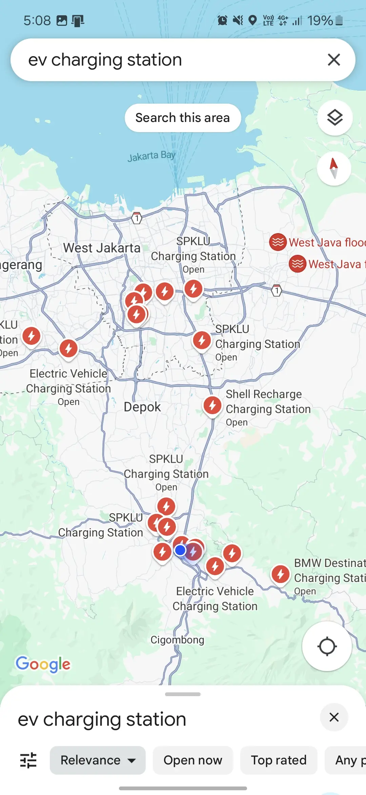
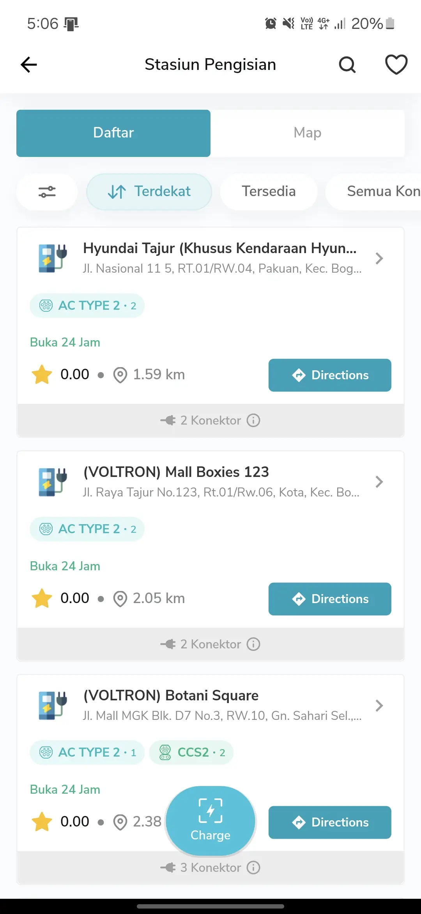
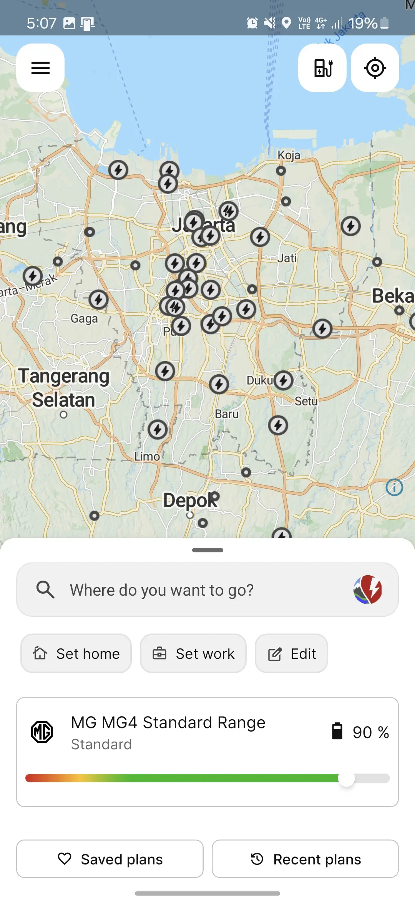
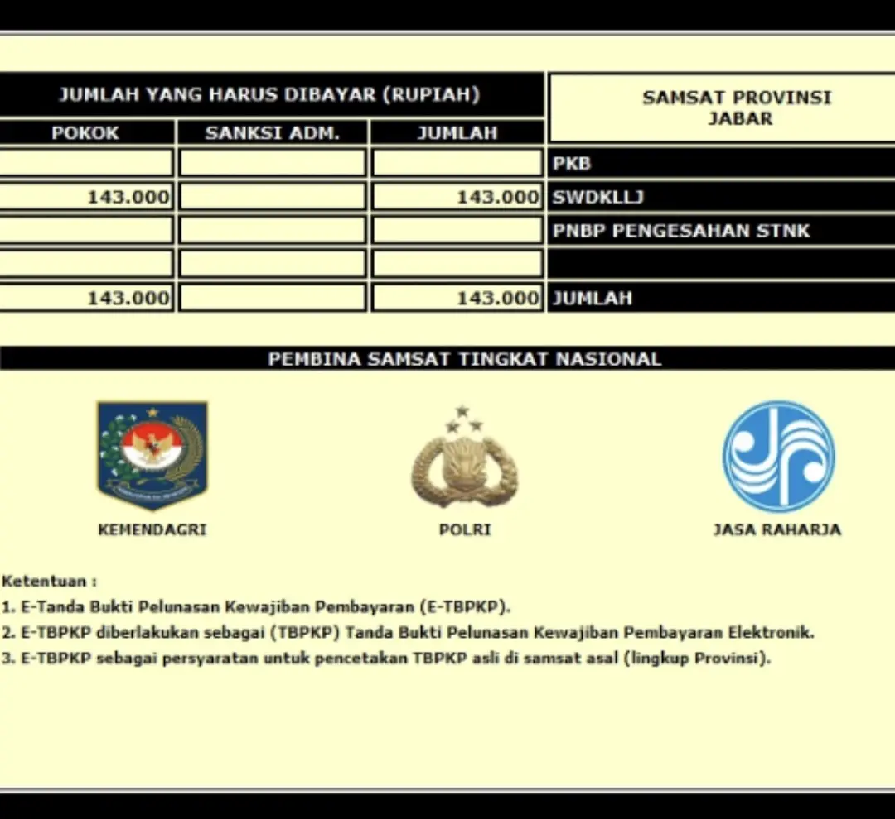

## EV adventure in Indonesia

While the global shift toward electric vehicles has seen varying levels of momentum, Indonesia is currently navigating a significant [transition](https://jakartaglobe.id/tech/indonesia-sees-robust-growth-in-electric-vehicle-sales-amid-global-decline#:~:text=According%20to%20data%20from%20the%20Indonesian%20Automotive%20Industry,of%20a%20total%20car%20market%20of%20784%2C788%20units). Driven by high fuel costs and a heavy influx of foreign investment, EVs are no longer a niche project—they are becoming a primary fixture in the local automotive market.

While Japanese manufacturers still hold the majority of the total car market, Chinese brands like BYD, SAIC, and GAC have broken into the top 10 for sales. Combined with Hyundai’s established presence and local battery production, the "electrified" road is becoming much more crowded.
It's also complemented by the fact that Indonesia is home to some of Southeast Asia's growing EV charging networks, with over [2,000 state owned fast-charging stations across the country](https://web.pln.co.id/media/siaran-pers/2024/09/perbanyak-charging-station-ev-pln-gandeng-pt-utomo-charge-indonesia-dan-acme-corporation#:~:text=Hartanto%20merinci%2C%20hingga%20Agustus%20tahun%202024%20ketersediaan%20SPKLU%20sebanyak%202.015%20unit.%20Jumlah%20ini%20juga%20diikuti%20oleh%20peningkatan%20jumlah%20Stasiun%20Penukaran%20Baterai%20Kendaraan%20Listrik%20Umum%20(SPBKLU)%20yang%20mencapai%202.182%20tersebar%20di%20seluruh%20Indonesia.). These include locations at gas stations, airports like Soekarno Hatta International Airport (JKC), and dedicated EV-friendly roads in cities such as Jakarta.

## EV driving experience

For urban residents in Jakarta or Surabaya, the move to EV is primarily a pragmatic financial decision rather than just an environmental one. In stagnant traffic, gasoline engines continue to consume fuel and generate heat. In an EV, the burn is negligible, making a two-hour crawl much less taxing on your wallet.

For someone new to EV usage, experiencing these vehicles can be transformative. Unlike gasoline-powered cars, which often come with discernible engine noise and vibrations, electric vehicles offer a smooth, silent ride that feels almost too good to drive. The absence of traditional engine exhaust further enhances the zero-emission perception while driving.

On the negative side though, Indonesia's roads can be a bit of an adventure, especially outside the cities where cracks and bumps are all part of the journey. With many EVs having lower ground clearance compared to the ever-popular SUVs, a bit of extra caution is needed when hitting those provincial roads.

## Indonesia network: A Grid of Opportunity

Since 2021, the government has been on a mission to build EV friendly charging stations across urban areas, making it easier than ever to keep our electric vehicle (EV) powered up and ready to roll. Most public EV charging points are conveniently located at gas stations, where multiple EVs can charge simultaneously.
With a growing number of dedicated electric vehicle friendly roads, we can experience even smoother driving with no waiting for charging ports. For instance, Jakarta has several fast charging stations on highways rest areas that cater specifically to electric vehicles.
In rural areas, the charging stations are mostly installed at PLN offices. What’s mind boggling is that during my visit to several smaller cities in Sumatra and Java, the central PLN office in each city already had fast charging stations installed.

### Ports problem avoided

The charging network has matured since the initial [2019 mandates](https://gatrik.esdm.go.id/assets/uploads/download_index/files/23211-200804-bahan-webinar-pm-esdm-13-2020-dirbinus-publikasi.pdf). By standardizing on CCS2 and Chademo early on, Indonesia avoided the "port wars" seen in North America.

That said, the ideal scenario is still to charge our vehicle at home. The Indonesian government has invested heavily in subsidizing new and existing EV users to support home charging. EV buyers can get a voucher from the state-owned electricity company (PLN) for [90% discount](https://web.pln.co.id/media/siaran-pers/2023/01/nge-charge-mobil-listrik-di-rumah-lebih-hemat-ada-promo-sambung-listrik-dari-pln) on new home EV charger installation.

### Looking for charging points?

Regular folks looking for charging station mostly relies on the default on their smartphone, either Google Maps or Apple Maps, which to be fair, provides *not so bad* EV charging points data. However, since the data isn't up to date, it could be a problem if you are outside urban areas.

[PLN's app](https://layanan.pln.co.id/pln-mobile) offer better discoverability, with the downside that it can't give you route planning. Other private charging companies also have their own app, like [Starvo](https://starvo.co.id/) or [Charge+](https://www.chargeplus.com/id).

My personal choice is [ABRP](https://abetterrouteplanner.com/). It has route planning function, has an extensive database of EVs down to their specs for better prediction, as well as quite up to date data. The catch is that it relies mostly on open-source data from [openchargemap](https://map.openchargemap.io/) so community support is crucial (*please contribute, I need your help*).

Similar apps like [PlugShare](https://www.plugshare.com/) also have their own fans, with more and more user sharing their data to the community. A combination of this apps and Google Maps, helped me to drive from Jakarta to Yogyakarta without a hassle.

## Affordability and costs of usage

### Initial costs

Indonesia offers a relatively affordable market for electric vehicles. While the prices can't quite match those in mainland China, the cheapest EVs in Indonesia are comparable to similar internal combustion engine (ICE) cars.

Take Cherry's [Omoda EV](https://www.oto.com/mobil-baru/chery/omoda-e5/pure) for example—it can be bought for roughly IDR 400 million, the same price with Honda's popular ICE car, [HRV](https://www.oto.com/mobil-baru/honda/hr-v/1-5l-e-cvt).
With government subsidies, the yearly tax for EVs is only a fraction of that for regular ICE cars. Using the same car as an example, the yearly tax for the Omoda EV is only about IDR 150k, while the HR-V can cost up to IDR 5 million, 33 times more expensive.

In Indonesia, there's an additional perk cars are treated as luxury goods and taxed more heavily. The luxury tax can amount to 20-30% of the car's value, but for EVs, it's 0%. So, if you're looking outside the econobox category, EVs can be more economical than ICE cars in the same class.

### Runing costs: Gasoline vs Electricity

The operational savings are clear, electricity costs roughly IDR 2,000 per kWh, making a commute to Bogor significantly cheaper than a liter of Pertamax. However, there is a hidden cost, *tires*. EVs are substantially heavier due to battery weight, which leads to faster tire wear. Since many EVs require specialized high-load tires, this is a recurring expense that new owners often overlook.

## The resell value tango

If you’re looking for a safe investment, the EV market still carries risk. The resale value for EVs in Indonesia remains more volatile than legendary value-holders like the Toyota.  

We are seeing a lease return spike, where early adoption vehicles are hitting the used market in large volumes, driving prices down. A high end EV can still lose 30-40% of its value in three years. However, as battery health transparency improves and local manufacturing stabilizes, this "resale tango" is slowly becoming more predictable.

## So, what now?

Two years into EV ownership, the benefits tax breaks, silent cabins, and minimal fuel costs outweigh the logistical hurdles. I wouldn’t trade the experience back for an ICE vehicle, but my advice is to buy for the long term. Chasing the latest battery tech every year is a losing game, find a model that fits your range needs today and run it until the savings have paid for the car itself.
