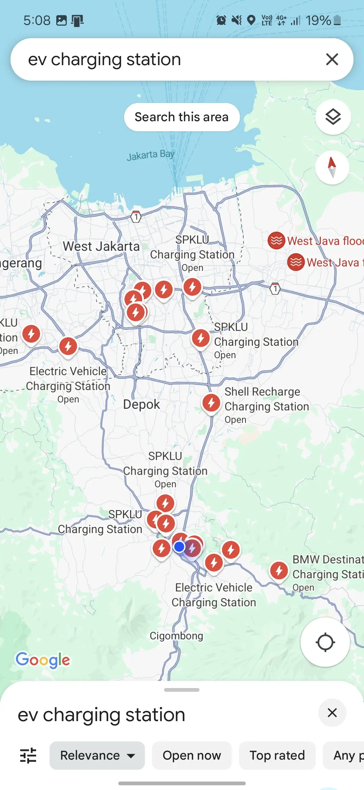
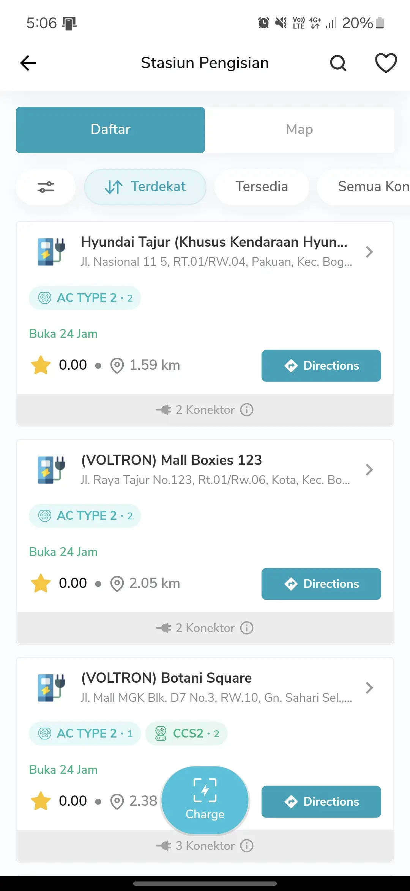
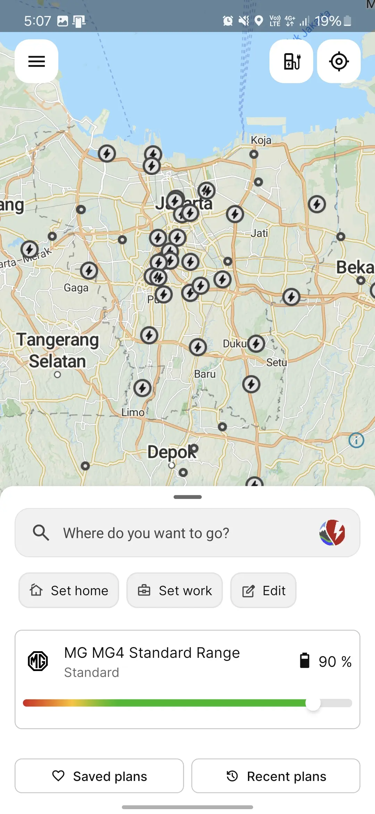
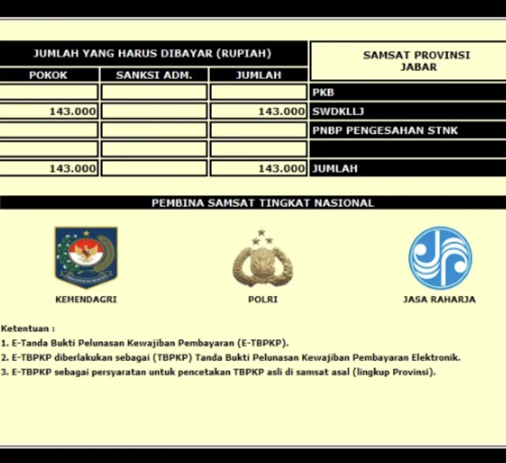

## EV adventure in Indonesia

In a world where transportation is evolving faster than a speeding bullet, this vibrant region is making headlines as locals and expats alike jump on the EV bandwagon. With fuel prices rocketing sky-high and a growing love for our planet, switching to EVs is [gaining traction](https://jakartaglobe.id/tech/indonesia-sees-robust-growth-in-electric-vehicle-sales-amid-global-decline#:~:text=According%20to%20data%20from%20the%20Indonesian%20Automotive%20Industry,of%20a%20total%20car%20market%20of%20784%2C788%20units) !!

Recently, Indonesia has been zipping ahead in the EV lane, supercharged by government policies that are wooing foreign investors. This electrifying shift is getting major love, with big-name EV champs from China (BYD, SAIC, GAC) and South Korea (Hyundai, LG Chem) setting up shop and assembling cars and batteries
It's also complemented by the fact that Indonesia is home to some of Southeast Asia's growing EV charging networks, with over [2,000 state owned fast-charging stations across the country](https://web.pln.co.id/media/siaran-pers/2024/09/perbanyak-charging-station-ev-pln-gandeng-pt-utomo-charge-indonesia-dan-acme-corporation#:~:text=Hartanto%20merinci%2C%20hingga%20Agustus%20tahun%202024%20ketersediaan%20SPKLU%20sebanyak%202.015%20unit.%20Jumlah%20ini%20juga%20diikuti%20oleh%20peningkatan%20jumlah%20Stasiun%20Penukaran%20Baterai%20Kendaraan%20Listrik%20Umum%20(SPBKLU)%20yang%20mencapai%202.182%20tersebar%20di%20seluruh%20Indonesia.). These include locations at gas stations, airports like Soekarno Hatta International Airport (JKC), and dedicated EV-friendly roads in cities such as Jakarta.

## EV driving experience

Living in bustling cities like Jakarta means dealing with traffic jams and pollution on the daily. But guess what? While gasoline engines can burn through your wallet in those never-ending traffic jams (we're talking more than an hour of barely moving), EVs offer an economical alternative.

For someone new to EV usage, experiencing these vehicles can be transformative. Unlike gasoline-powered cars, which often come with discernible engine noise and vibrations, electric vehicles offer a smooth, silent ride that feels almost too good to drive. The absence of traditional engine exhaust further enhances the zero-emission perception while driving.

On the negative side though, Indonesia's roads can be a bit of an adventure, especially outside the cities where cracks and bumps are all part of the journey. With many EVs having lower ground clearance compared to the ever-popular SUVs, a bit of extra caution is needed when hitting those provincial roads.

## Indonesia network: A Grid of Opportunity

Since 2021, the government has been on a mission to build EV-friendly charging stations across urban areas, making it easier than ever to keep our electric vehicle (EV) powered up and ready to roll. Most public EV charging points are conveniently located at gas stations, where multiple EVs can charge simultaneously.
With a growing number of dedicated electric vehicle friendly roads, we can experience even smoother driving with no waiting for charging ports. For instance, Jakarta has several fast-charging stations on highways rest areas that cater specifically to electric vehicles.

In my experience, commuting and driving within Jakarta never been a problem.
Shopping malls in urban areas have also jumped on the EV bandwagon, offering multiple levels of parking where cars can charge in about 30 minutes, depending on their capacity. It's the perfect spot for both short and long-term parking while you shop or relax.
In rural areas, the charging stations are mostly installed at PLN offices. What’s mind-boggling is that during my visit to several smaller cities in Sumatra and Java, the central PLN office in each city already had fast charging stations installed.

### Ports problem avoided

Unlike the USA, where different car companies use various charging ports, Indonesia sidestepped this issue right from the start.  [Government issued mandate](https://gatrik.esdm.go.id/assets/uploads/download_index/files/23211-200804-bahan-webinar-pm-esdm-13-2020-dirbinus-publikasi.pdf) in 2019 requires car manufacturers to use either CCS2 or Chademo ports, and the infrastructure is built to support this law.

That said, the ideal scenario is still to charge our vehicle at home. The Indonesian government has invested heavily in subsidizing new and existing EV users to support home charging. EV buyers can get a voucher from the state-owned electricity company (PLN) for [90% discount](https://web.pln.co.id/media/siaran-pers/2023/01/nge-charge-mobil-listrik-di-rumah-lebih-hemat-ada-promo-sambung-listrik-dari-pln) on new home EV charger installation.

### Looking for charging points?

Regular folks looking for charging station mostly relies on the default on their smartphone, either Google Maps or Apple Maps, which to be fair, provides *not so bad* EV charging points data. However, since the data isn't up to date, it could be a problem if you are outside urban areas.

[PLN's app](https://layanan.pln.co.id/pln-mobile) offer better discoverability, with the downside that it can't give you route planning. Other private charging companies also have their own app, like [Starvo](https://starvo.co.id/) or [Charge+](https://www.chargeplus.com/id).

My personal choice is [ABRP](https://abetterrouteplanner.com/). It has route planning function, has an extensive database of EVs down to their specs for better prediction, as well as quite up to date data. The catch is that it relies mostly on open-source data from [openchargemap](https://map.openchargemap.io/) so community support is crucial (*please contribute, I need your help*).

Similar apps like [PlugShare](https://www.plugshare.com/) also have their own fans, with more and more user sharing their data to the community. A combination of this apps and Google Maps, helped me to drive from Jakarta to Yogyakarta without a hassle.

## Affordability and costs of usage

### Initial costs

Indonesia offers a relatively affordable market for electric vehicles. While the prices can't quite match those in mainland China, the cheapest EVs in Indonesia are comparable to similar internal combustion engine (ICE) cars.

Take Cherry's [Omoda EV](https://www.oto.com/mobil-baru/chery/omoda-e5/pure) for example—it can be bought for roughly IDR 400 million, the same price with Honda's popular ICE car, [HRV](https://www.oto.com/mobil-baru/honda/hr-v/1-5l-e-cvt).
With government subsidies, the yearly tax for EVs is only a fraction of that for regular ICE cars. Using the same car as an example, the yearly tax for the Omoda EV is only about IDR 150k, while the HR-V can cost up to IDR 5 million—33 times more expensive!

In Indonesia, there's an additional perk—cars are treated as luxury goods and taxed more heavily. The luxury tax can amount to 20-30% of the car's value, but for EVs, it's 0%. So, if you're looking outside the econobox category, EVs can be more economical than ICE cars in the same class.

### Runing costs: Gasoline vs Electricity

The long-term operational cost savings from using electricity instead of gasoline make EV ownership a cost-effective proposition in the long run.
Again, with the car comparison, an econobox like Daihatsu's Ayla can run for 700 km on 36 liters of gasoline, giving you around 20 km per liter. With gasoline prices at IDR 12k per liter, it can add up. Now, take Wuling's Binguo with a 32 kWh battery that can run 300 km on a single charge. With current electricity fares at around IDR 2k per kWh, you can drive from Jakarta to Bogor (about 60 km) for the same cost as driving the Daihatsu from Central Jakarta to West Jakarta. It's THAT cheap!

But wait, is it all rainbows? Nah. There's a hidden cost of running EV that people haven't caught, yet. It's the tire. EV generally is heavier than regular ICE cars because of the battery. That impacts heavily on the wheels, making it wear faster. To add salt to the wound, EV tires are also more expensive than regular tire.

## The resell value tango

If everything that you've read until now is mostly positive, then I'll bring the biggest bad news. The resell value for EV in Indonesia is BAD.
I can't say that it's abysmal, but the drop in value can be more felt compared to regular ICE vehicles, especially for EV that cost more than IDR 500 million.
To give us a picture, new Ioniq 5 SLR sold for IDR 800 million in 2022. 2 years of usage brought it down to IDR 550 million, losing 30% for over 2 years of usage. Even though it's not apple to apple, Toyota's popular Innova line still held more than 60% of it's value after 5 years of usage.

Now, EVs might seem like they’re losing their shine compared to traditional cars in Indonesia. But hey remember that used ICE vehicles hold up better? It's a bit of a bummer fact but let’s focus on the positives.
Looking at the statistics, there's still hope. Secondhand Daihatsu's Ayla from 2023 [costs IDR 145 million](https://www.mobil123.com/mobil-dijual/daihatsu/ayla/year-2023/indonesia), retaining 80% of its value over 2 years of usage. Second hand Binguo of the same year, [sold for IDR 260 million](https://www.mobil123.com/mobil-bekas-dijual/wuling/binguo-ev/indonesia?page_size=25), originally sold for IDR 320 million. Losing the same percentage of value for over 2 years of usage.
With EV battery market become more mature, and the industry growing locally, hopefully it will become better overtime.

## So, what now?

Am I enjoying driving an EV? Absolutely! I've had to tweak my driving habits a bit, but these past two years of EV ownership have been mostly pure joy. The cheap tax and operation cost has been a blessing in this economy.

Would I buy another EV? You bet! But I think I'll wait until the battery innovations slow down a bit. It seems wiser to wait for the market to mature rather than chase the newest technology every year, which drives down the price of older EV models.
Do I recommend others make the switch? Totally! The more, the merrier!
Of course, take this advice with a pinch of salt.
