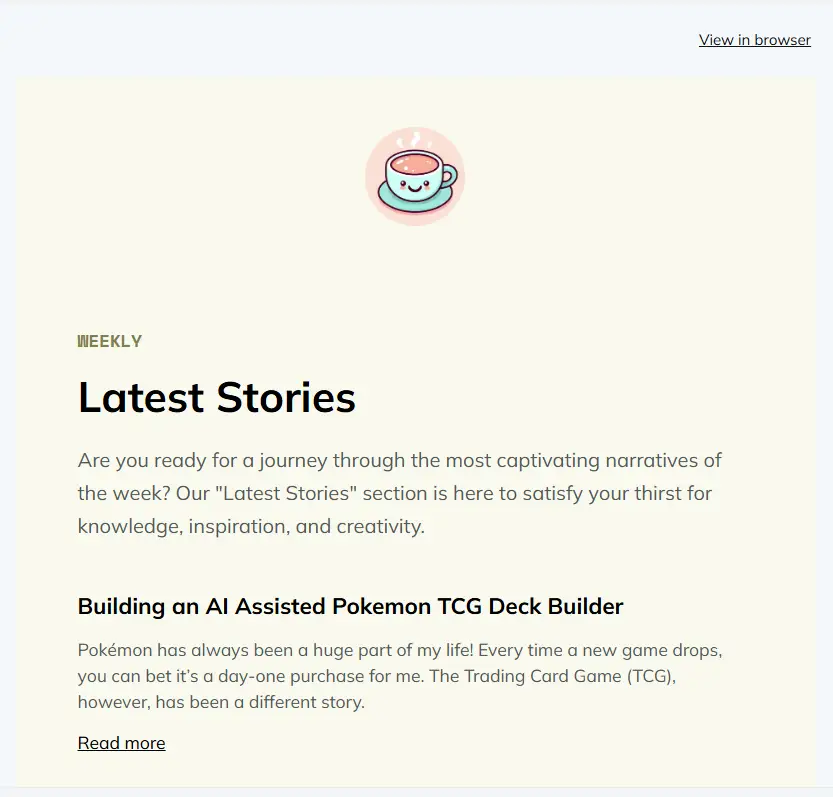
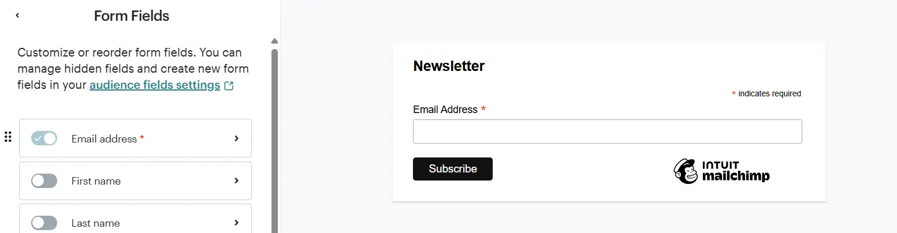
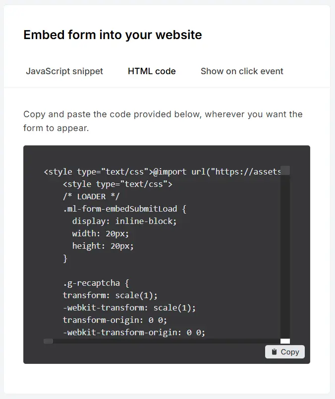
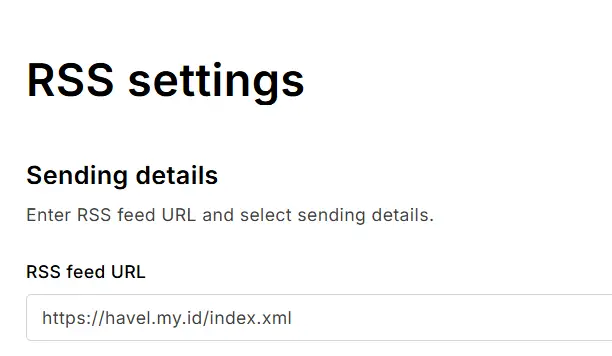
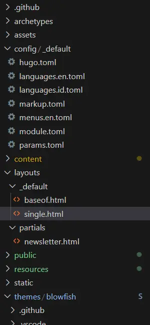

When I revisited my blog last year, my priority was ownership. I chose the GitHub + Hugo stack specifically to keep my content in markdown and version controlled.

However, static sites have a classic state problem like how do you manage a subscriber list without a database? After realizing readers were missing new posts because they weren't checking RSS feeds manually, I decided to bridge the gap using an automated newsletter system.

## Hugo + Mailchimp = Newsletter Match

Since Hugo generates an index.xml file by default, it already provides a machine-readable stream of new content. Instead of building a custom backend, I used Mailchimp’s RSS-to-Email feature. It polls the feed, detects new entries, and triggers an automated campaign.

I went with [Mailchimp](https://mailchimp.com/) because its free tier is sufficient for a personal technical blog. Interestingly, there is very little documentation on this specific integration, so I’ve outlined the implementation steps below.

## Set Up Your Email Campaign

Mailchimp provides pre made templates, which you can modify to match your blog’s style. I picked one and gave it a fresh look.


The next step is to build newsletter signup form. Modern email platforms like Mailchimp, MailerLite, and Brevo have drag and drop form builders with predefined UI kits. Nothing fancy, but helps quite a lot for simple task like this.


When you’re happy with the design, copy the generated CSS and HTML code, we’ll need it later for the blog.


Inside Mailchimp, go to "Campaigns" and create a new campaign. Fill in the details and ensure the RSS URL points to your Hugo generated feed. By default, Hugo places it in the root directory, like `https://havel.my.id/index.xml`


## Add the Signup Form to Hugo

Thankfully, Hugo allows [advanced customization](https://gohugo.io/hugo-modules/theme-components/) where we can override templates partially.

- Create a new directory `layout/partials`
- Create a new file `newsletter.html`
- Paste the CSS and HTML code from Mailchimp

If your browser block the hosted CSS, then just copy the CSS content to the partial.
Since I wanted the newsletter form to appear in every blog post, I edited single.html:

- Create a new directory: `layout/_default` (if it doesn’t exist)
- Create a new file `single.html` (in newer hugo version this will be `single._extend.html`)
- Copy the contents of your theme’s `single.html` file into the new one


To keep the implementation clean, I used Hugo’s params to toggle the newsletter on or off globally.

```toml
    [mailchimp]
        newsletter = true
```

Finally, let’s render the signup form in blog posts by adding this code inside `single.html`

```html
    {{ partial "series/series-closed.html" . }}
    {{ partial "sharing-links.html" . }}
    {{ partial "related.html" . }}  

    {{ if .Site.Params.mailchimp.newsletter | default false }}
        {{ partial "newsletter.html" . }}
    {{ end }}
```

I placed mine after related links, but you can put it anywhere you like. Once this is set up, the signup form will automatically appear as long as partial "newsletter.html" is called on the page.
This setup should've maintain the static nature of the site while providing a dynamic way to retain readers. 
