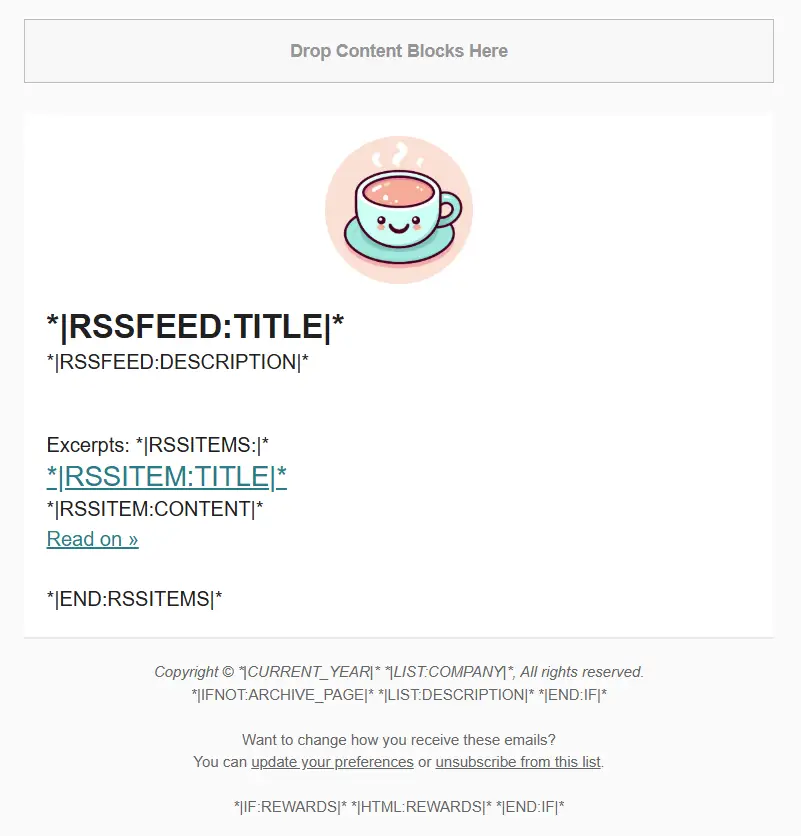
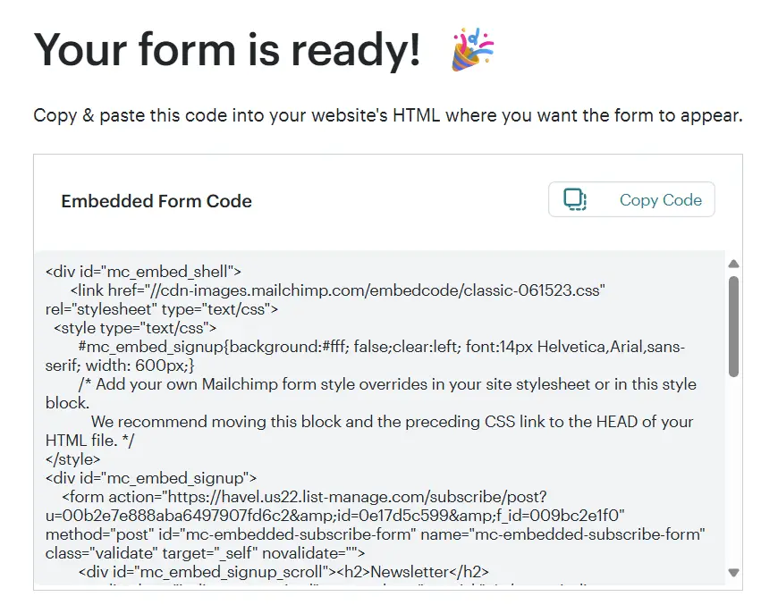
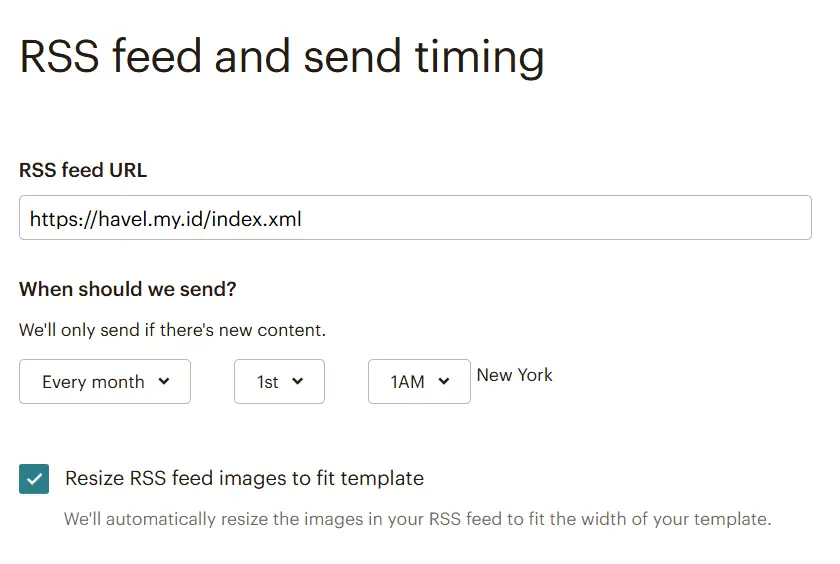

When I rekindled my blog last year, my main focus was clear: keep it simple and concentrate on writing! I explored several platforms like Medium and dev.to, but ultimately landed on the GitHub + Hugo combo for the beauty of content ownership.
Fast forward a few months, and after chatting with friends, I realized one big issue—they had a hard time knowing when new posts were live! While I haven’t done much in terms of crossposting to places like LinkedIn or HackerNews, I wanted to make sure my readers stayed updated. That’s when I started hunting for a newsletter system!

## Hugo + MailerLite = Newsletter Match

Since Hugo generates static pages (which is great for speed and simplicity!), I didn’t want to complicate things with a database for tracking users. But, Hugo has RSS support! Every new post updates the XML entries with the post title and a snippet of content. I can work with this!
After researching different newsletter platforms, I chose [MailerLite](https://www.mailerlite.com/) for my campaign. Their free plan allows up to 1,000 subscribers and 12,000 emails per month—more than enough for this cozy blog!
Funny enough, when I searched for tutorials on integrating mail service with Hugo, I found almost nothing! Either it’s super easy or no one’s documented it. So, I’m here! Whoever needs some sort of guideline, my notes might help you!

## Set Up Your Email Campaign

MailerLite provides pre made templates, which you can modify to match your blog’s style! I picked one and gave it a fresh look.


The next step is to build newsletter signup form. Modern email platforms like MailerLite, Sender, and Brevo have drag and drop form builders with predefined UI kits. Nothing fancy, but helps quite a lot for simple task like this.


When you’re happy with the design, copy the generated CSS and HTML code, we’ll need it later for the blog.


Inside MailerLite, go to "Campaigns" and create a new campaign. Fill in the details and ensure the RSS URL points to your Hugo-generated feed. By default, Hugo places it in the root directory, like `https://havel.my.id/index.xml`


## Add the Signup Form to Hugo

Thankfully, Hugo allows [advanced customization](https://gohugo.io/hugo-modules/theme-components/) where we can override templates partially. Let’s create a new partial for our newsletter form:

- Create a new directory `layout/partials`
- Create a new file `newsletter.html`
- Paste the CSS and HTML code from MailerLite

Since I wanted the newsletter form to appear in every blog post, I edited single.html:

- Create a new directory: `layout/_default` (if it doesn’t exist)
- Create a new file `single.html`
- Copy the contents of your theme’s `single.html` file into the new one


Now, let’s add a global parameter in config to activate the newsletter feature

```toml
    [mailerlite]
        newsletter = true
```

Finally, let’s render the signup form in blog posts by adding this code inside `single.html`

```html
    {{ partial "series/series-closed.html" . }}
    {{ partial "sharing-links.html" . }}
    {{ partial "related.html" . }}  

    {{ if .Site.Params.mailerlite.newsletter | default false }}
        {{ partial "newsletter.html" . }}
    {{ end }}
```

I placed mine after related links, but you can put it anywhere you like! Once this is set up, the signup form will automatically appear as long as partial "newsletter.html" is called on the page.
And that’s it, your blog now has a fully functional newsletter system! Hope this guide helps, and if you give it a try, let me know how it goes! Happy blogging!
