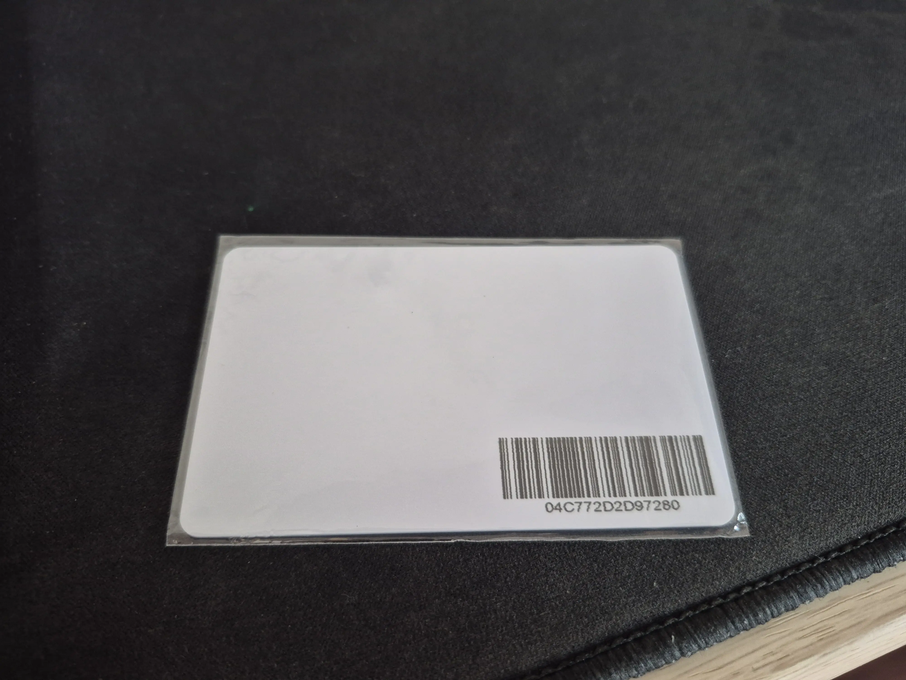
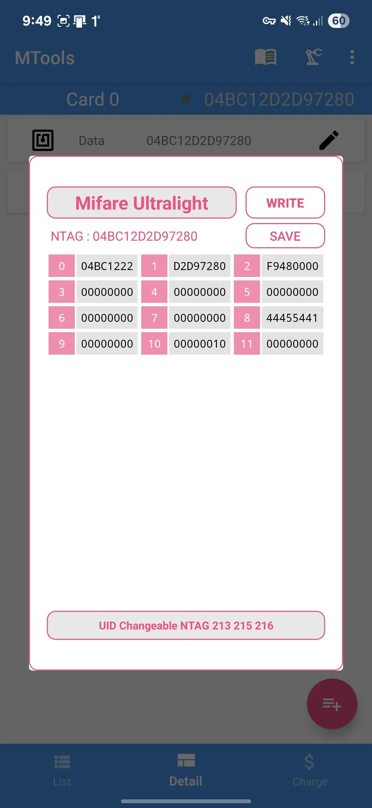
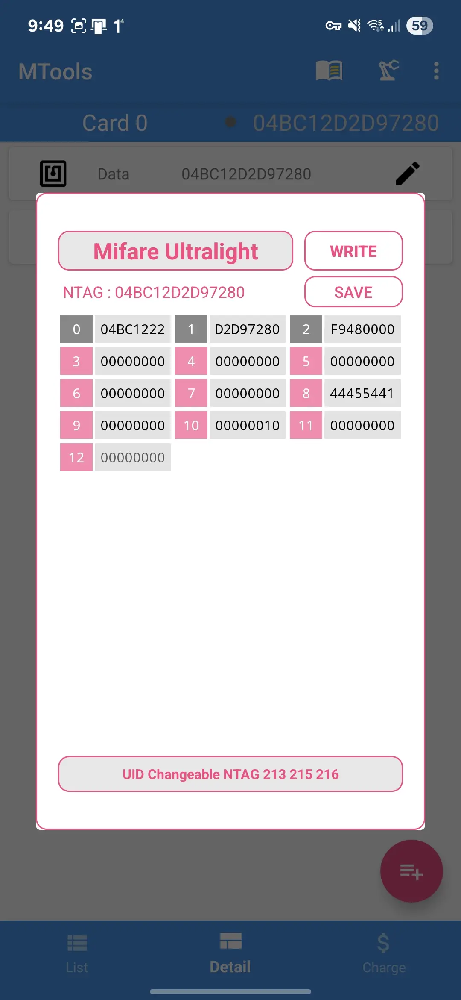
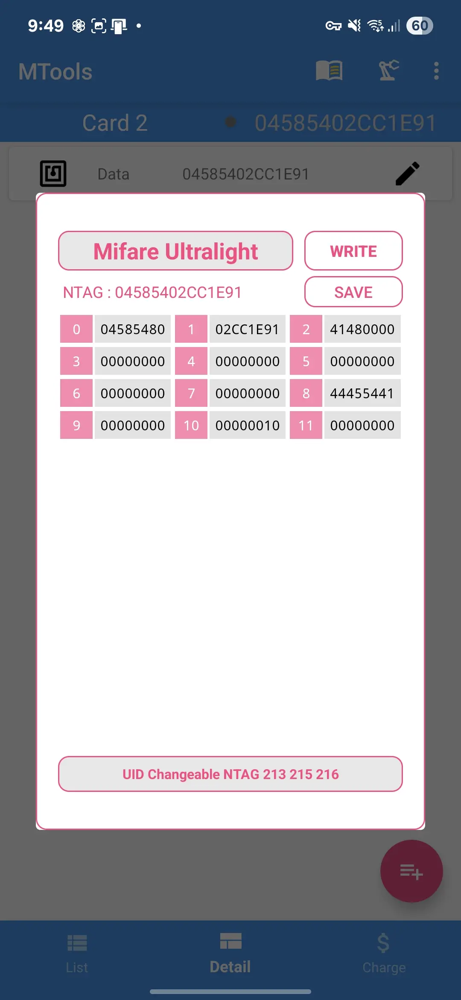

Two years into EV ownership and I have no complaint at all about the car. Every time I drive down the street, it's always nothing but a whisper under the hood. Hyundai really set me up nicely when I bought the car, home charger and all, making the whole charging experience easy.
But here’s my one tiny gripe, that little NFC charger card. It lives in my wallet, rubs shoulders with ten other plastic cards, and has survived more toddler “testing” than I’d like to count. When my daughter decided it made a perfect teething toy, I knew it was time for drastic measures. Sure, Hyundai gave me a spare, but there's nothing bad having a backup of a backup right? 3-2-1 backup rule must be uphold.

## The Mystery Card

Looking at the card, there were no clues. Just a blank NFC card with a barcode. So naturally, I had to figure out what type of NFC it was. My educated (read: hopeful) guess? A standard Mifare card.

I turned to my phone and installed [NFC Tools]((https://play.google.com/store/apps/details?id=com.wakdev.wdnfc&hl=en)). It’s user friendly and best of all, free (because I’m a cheapskate). With the help of the app, I discovered that this elusive card is a `Mifare Ultralight`. That’s both good and bad, good because it’s common, and bad because encryption is now part of the party.

The next step is to read the data. I tried reading the card data with NFC Tools, but it taps out at Mifare Classic, so I leveled up to [MTools](https://play.google.com/store/apps/details?id=tk.toolkeys.mtools&hl=en-US). It's a paid application, but it's far cheaper than shilling the money for a dedicated NFC reader hardware or a `Flipper Zero`. A few seconds later and I got the byte dumps.

## Flipping the Zero

Now, it's finally come to fun part, duplicating the bits. With Mifare Classic, it's quite straight forward, copy the data, store it, then write it to a new card. Unfortunately, that is not the case for this one. Add on that, that Mifare Ultralight have a lot of variations.
Looking at the copied data, it only use 11 pages with 4 bytes per page, so technically any card having 20 pages rewritable space in the EEPROM would suffice. I took the gamble and bought several [`Mifare Ultralight EV1`](https://www.rfidcard.com/wp-content/uploads/2025/04/RFID-Card-NXP-MIFARE-Ultralight-EV1-datasheet-AZC-ULEV1-CR80.pdf) and [`Mifare Ultralight C`](https://www.rfidcard.com/wp-content/uploads/2025/05/RFID-Card-NXP-MIFARE-Ultralight-C-datasheet-AZC-ULC-CR80.pdf) cards which doesn't have high level of security features. Clearly there's not so much information stored in the card, so why bother buying high spec'ed one? Those cards supports `RC522` specs used by Hyundai card.
First attempt? I copied everything. Every byte. Expecting miracle. The result? It failed (smile). I tried to do the same to both cards with no avail. Next, brite force combo attempt, trying to copy parts of the data with several combinations. Still, the charger refused to play along.

Time to dig deeper.

Analyzing the data, I realized it only used 11 pages (each with 4 bytes). Then I had an epiphany, somewhere between frustration and caffeine, maybe the first few pages are the card ID, not the actual useful data. Turns out the first 3 pages held the card's unique ID and copying that was a big no-no. Imagine forging a passport and leaving the original photo. So I excluded the first 3 pages from the copy operation, targeted page 8 where the real action seemed to be, and cloned just the essentials.

Copy just the good stuff.

Notice the difference in between the two data. Each new card now boasts its own `NTAG` and have different identifier data in the first 3 pages but the all important page 8 matches the original. I'm banking on the chance that the EV charger device won't perform two ways encryption. If this experiment fail, then it's going to be more complicated since I need to figure out the encryption method and other hard stuffs, but let's see, maybe the lady luck is on my side.

## Moment of Truth

Now, it's just the time for testing!

