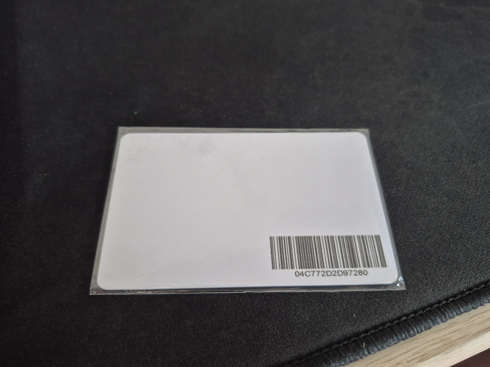
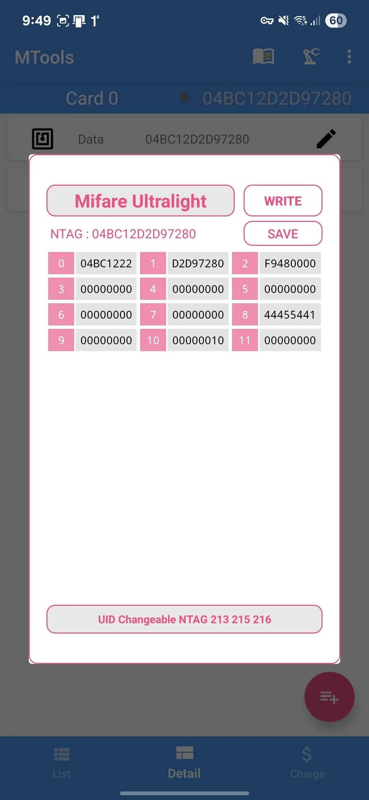
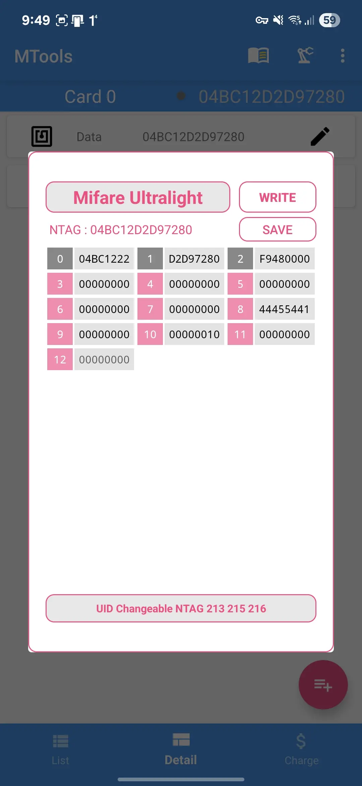
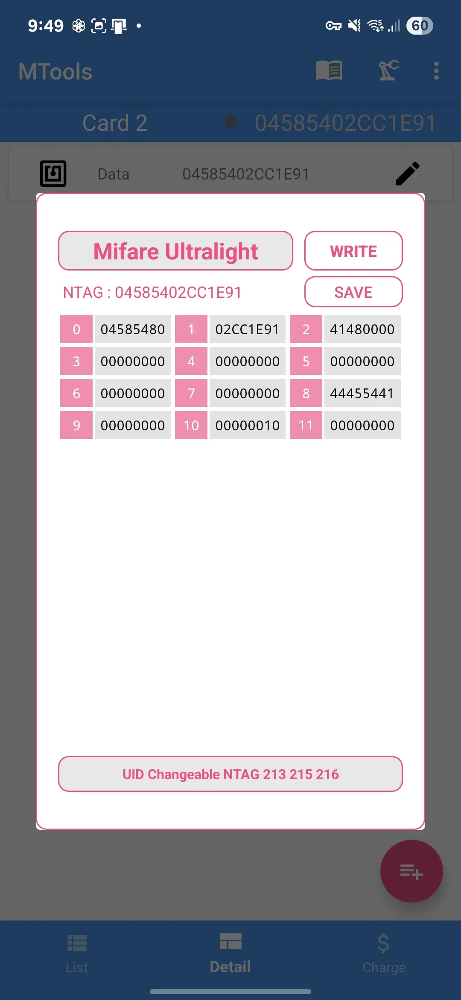

Two years into EV ownership and I have no complaint at all about the car. Hyundai really set me up nicely when I bought the car, home charger and all, making the whole charging experience easy.

However, the physical access layer, the proprietary NFC card provided for the home charger, presented a single point of failure. After my toddler decided the card made an excellent teething toy, I decided to apply the 3-2-1 backup rule to my physical charger keys.

## The Mystery Card

Looking at the card, there were no clues. The card itself is a blank white slate with a barcode and no technical specifications. Rather than paying for a dealer replacement, I set out to clone the card using only an Android device and a few off the shelf tags.

To identify the chipset, I used [NFC Tools](https://play.google.com/store/apps/details?id=com.wakdev.wdnfc&hl=en). The scan revealed a `Mifare Ultralight` tag. This was a mixed bag, it's a common, low cost standard, but it often utilizes specific page locking or basic encryption that makes simple "dumb" cloning difficult.

Standard tools like NFC Tools are sufficient for basic NDEF records, but to see the raw hex, I switched to [MTools](https://play.google.com/store/apps/details?id=tk.toolkeys.mtools&hl=en-US). While a Flipper Zero or a dedicated Proxmark3 would be the professional choice, a smartphone with a high quality NFC antenna can handle Mifare Ultralight byte dumps just fine.

## Flipping the Zero

Now, it's finally come to fun part, duplicating the bits. With Mifare Classic, it's quite straight forward, copy the data, store it, then write it to a new card. Unfortunately, that is not the case for this one. Add on that, that Mifare Ultralight have a lot of variations.
The dump revealed that the data was relatively sparse, occupying only 11 pages (4 bytes per page), so technically any card having 20 pages rewritable space in the EEPROM would suffice. 

I took the gamble and bought several [`Mifare Ultralight EV1`](https://www.rfidcard.com/wp-content/uploads/2025/04/RFID-Card-NXP-MIFARE-Ultralight-EV1-datasheet-AZC-ULEV1-CR80.pdf) and [`Mifare Ultralight C`](https://www.rfidcard.com/wp-content/uploads/2025/05/RFID-Card-NXP-MIFARE-Ultralight-C-datasheet-AZC-ULC-CR80.pdf) cards which doesn't have high level of security features. Clearly there's not so much information stored in the card, so why bother buying high spec'ed one? Those cards supports `RC522` specs used by Hyundai card.
My first attempt was a full byte for byte copy. The result? It failed (smile). I tried to do the same to both cards with no avail. Next, brute force combo attempt, trying to copy parts of the data with several combinations. Still, the charger refused to play along.

Time to dig deeper.

I analyzed the hex dumps again. The "Aha!" moment came when I realized the charger likely wasn't looking for a specific Card ID, but rather a specific authentication token stored in the user memory. Turns out the first 3 pages held the card's unique ID and copying that was a big no-no. By keeping the new card's original UID (Pages 0-2) and only cloning the data in Page 8, I was able to replicate the specific "key" the charger was looking for without triggering the consistency errors caused by a failed UID clone.

Copy just the good stuff.

Notice the difference in between the two data? Each new card now boasts its own `NTAG` and have different identifier data in the first 3 pages but the all important page 8 matches the original. I'm banking on the chance that the EV charger device won't perform two ways encryption. If this experiment fail, then it's going to be more complicated since I need to figure out the encryption method.

## Moment of Truth

Now, it's just the time for testing!

