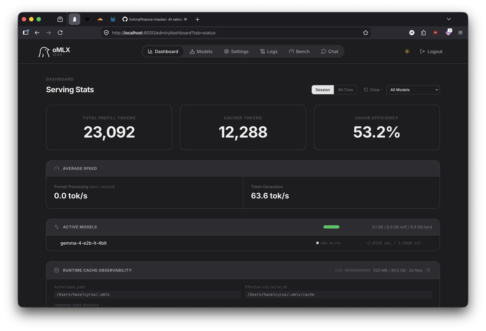
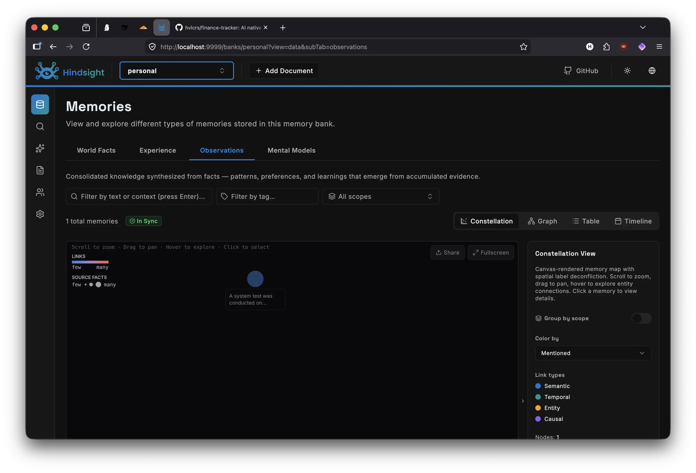
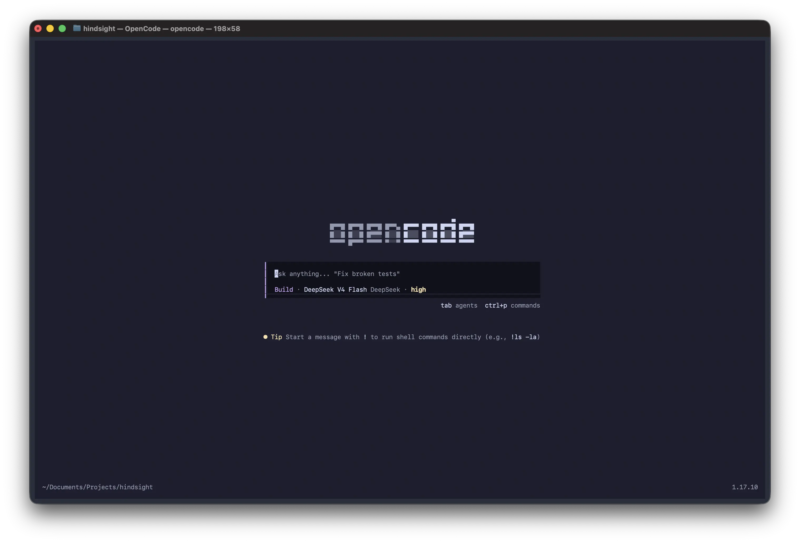

A lot has changed this past two years in the AI space. I used to think the debate was local vs. cloud. Pick a side, commit, move on. Turns out, that's the wrong question entirely.

The real answer is both. Cloud models for heavy lifting, long form writing, complex reasoning, coding, architectural decisions. Local models for everything sensitive, private codebases, internal docs, or simple tasks. These kind of works doesn't need the high level of compute of the frontier models.

It took me a while to get the balance right. I went through a lot of tools before landing on a stack that finally clicked. Here's where I ended up and why.

## Why omlx Instead of LM Studio or Ollama

I cycled through all three before settling on omlx. Here's why the others didn't stick.

**[Ollama](https://ollama.com)** is the easiest to get started with, no question. But its *slow*. You can't tweak batching, concurrency, or GPU utilization. On Mac, it doesn't fully leverage Metal Performance Shaders, so you're leaving speed on the table and you don't even know it.

**[LM Studio](https://lmstudio.ai)** has a beautiful UI. But it's a GUI first app, and I live in the terminal. Backgrounding an Electron app just to serve models feels wrong. Plus, that Electron shell competes for RAM with the model itself. On a memory constrained machine, that's a real cost.

**[omlx](https://github.com/Mizistein/omlx)** is built for the terminal from the ground up. Single binary, zero runtime dependencies. It talks to Metal directly on Apple Silicon, no wrappers, no virtualization layers. And it gives me explicit control over batch size, context length, and GPU layers. I can tune it exactly how I want.



## Why It's Faster on Mac

Apple Silicon's unified memory is a cheat code for local LLMs. The GPU and CPU share the same pool, no PCIe bottleneck, no copying tensors back and forth. But most serving software treats it like a discrete GPU and loses all the advantage.

omlx uses Metal Performance Shaders directly, mapping model weights into shared memory with zero copy tensor operations. On my work machine with 64GB of unified memory, I can run 13B to 34B parameter models at usable speeds without any quantization tricks. The exact same models on Ollama or LM Studio? 20-40% lower token throughput on identical hardware. I even use the same setup in my own personal machine. The same stack can runs in a humble 16GB Mac.

Three things make the difference:

1. Native Metal backend, no MoltenVK or CUDA translation layers adding overhead
2. Efficient KV-cache management, unused cache entries get paged to compressed memory
3. Model-aware scheduling, it knows which layers belong on GPU vs. CPU and schedules accordingly

## Keeping the Memory Alive



The biggest headache with any LLM setup is this, every conversation starts from scratch. No memory of your projects, your preferences, or what you decided last week. It's like Groundhog Day, but with more debugging.

I use two tools to fix this. **[hindsight](https://github.com/vectorize-io/hindsight)** is a long term memory system built right into the client. It operates on three primitives. `recall` searches past memories, `reflect` synthesizes them into answers, and `retain` stores new information. Every important fact, decision, or preference gets saved automatically. I don't think about it anymore. **[omlx](https://github.com/Mizistein/omlx)** handles the actual model serving. Loading, unloading, keeping warm models in memory, providing a consistent API across local and cloud backends. Together they form a persistence layer. hindsight stores what I've learned, omlx serves the models that use that knowledge. Simple in concept, transformative in practice.

## Hindsight vs Manual Curation

Most people solve the memory problem by writing a `CLAUDE.md` or `AGENTS.md` file. You dump your project context, coding conventions, and personal preferences into a static document that gets injected into every single prompt. It works, but it has two problems. First, it's manual. Every time your setup changes, you have to remember to update the file. Second, it's wasteful. That entire document gets stuffed into every prompt, even when the task has nothing to do with your pinned rules. You either keep it short and miss context, or let it grow and burn tokens.

Hindsight takes a different approach. Instead of pushing a static file into every prompt, it pulls relevant context only when needed. The `retain` primitive captures observations automatically during conversations, storing them as searchable memories. When the model needs context, the `recall` primitive performs a semantic similarity search across all stored memories, returning only the snippets that are actually relevant to the current task. The `reflect` primitive goes a step further, synthesizing across multiple related memories into a single coherent answer.

This pull based model is far more efficient than the traditional approach. A static `CLAUDE.md` is push based, it injects irrelevant context into every prompt, eating into your context window and distracting the model. Pull based means the model decides when memory is needed by invoking `recall` or `reflect` as tools. The default prompt stays lean. Only relevant memories are retrieved. No manual curation, no stale rules, no token waste. It's the difference between dumping your entire filing cabinet on the desk every morning and asking for exactly the one folder you need.

## Turning MCP into CLI

I run a lot of MCP servers. Programming language context, git operations, web fetching, database queries, the usual toolbox. But MCP has a dirty secret, every tool's markdown schema gets injected into the system prompt. With tens tools configured, those schemas can eat thousands tokens per prompt before we've even said anything.

I convert mine to CLI commands using [mcporter](https://github.com/openclaw/mcporter). It wraps MCP servers behind a dead-simple command-line interface:

```
mcporter run /path/to/server --tool tool_name '{"arg": "value"}'
```

What was `mcp.run({server, tool, args})` becomes `mcporter run server --tool tool 'args'`. A flat CLI call. No baggage.

## CLI + Skills Over Raw MCP

This is the part that made the biggest difference. Running tools as CLI commands via mcporter drops context usage dramatically. Instead of injecting tool definitions into every single prompt, I define *skills*, short instruction blocks that describe what a tool does and when to use it. The skill only loads when the AI decides it actually needs that capability.

In this architecture, the default context stays small and efficient. Because most prompts only need to carry standard system instructions and the ongoing conversation history, the system avoids being weighed down by unnecessary data from the jump.

Efficiency is further maintained because tools are strictly opt-in. Instead of loading every available capability up front, the AI dynamically requests a specific skill only when needed, retrieves its schema, executes the task, and then immediately discards the schema.

This on demand approach ensures there is no tool bloat lagging the system down. By loading schemas only during active use, the typical 1-4K token overhead per prompt drops to zero for the vast majority of interactions, resulting in a much leaner and faster operation.

Skills are composable too. I can chain "search docs" → "read file" → "edit file" without keeping all three schemas in context at once. The AI only loads what it needs, when it needs it.

## opencode vs the Rest

I tried several terminal AI clients before settling on opencode.

**[Codex](https://github.com/openai/codex)** is fast and dead simple. But the toolings differs a lot compared to the other agents. Everytime I develop a generic skills or custom agent I need to retrofit this into Codex format. Since I also run AI agent on my machine, keeping multiple format of skills is *a big no go*.

**[Claude Code](https://docs.anthropic.com/en/docs/claude-code/overview)** is more capable. I use it a lot at work but it's mostly locked to Claude only. No agent system. Customization stops at a config file.

**[pi](https://github.com/earendil-works/pi)** is small and fast. Everything is flat. The system prompt is less than 100 tokens. Anything complex needs a very detailed prompt and/or multiple loops.

**[opencode](https://opencode.ai)** is the more configurable compared to Claude Code or Codex. Multiple model backends (omlx locally, Anthropic and OpenAI in the cloud). A full agent system with different tool access levels. Skills. MCP integration. Subagents. Permission rules. I route quick edits through local models on omlx and heavy reasoning through Claude, all from the same client.



## From pi to opencode

I used `pi` before this. And I loved it at first, single binary, blazing fast startup, sensible defaults. But that minimalism became a wall. Adding tools, configuring memory, integrating MCP, everything required detailed prompt or skills chaining. It was extensible in theory, but in practice I was forking and rewriting.

opencode hits a different sweet spot. Install it with `pip install opencode` and it just works out of the box. But when you need more, you add agents, skills, permission rules, and model routing, all through a JSON config file. No forking. No glue code. It's configurable in practice, not just in theory.

That's the difference. pi made me work for every extension. opencode grows with you, declaratively.

## The Stack


flowchart TB
    subgraph OC["opencode"]
        HM["hindsight memory"]
        SA["skills + agents"]
    end

    subgraph OM["omlx"]
        L["local Metal"]
        C["cloud API"]
    end

    subgraph MC["mcporter"]
        CLI["CLI tools"]
    end

    HM --> SA
    SA --> L
    SA --> C
    MC --> SA


Everything runs in the terminal. No GUI overhead, no context bloat, no data leakage. Just fast models, persistent memory, and tools that get out of your way until you actually need them.
