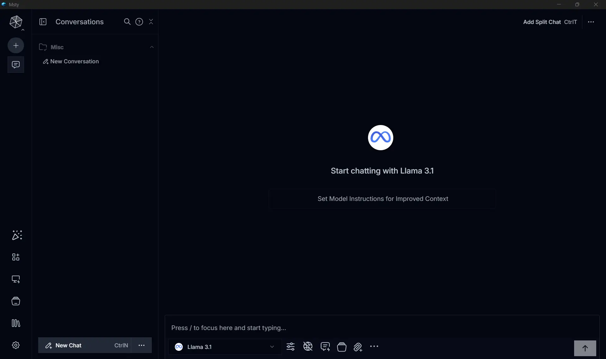
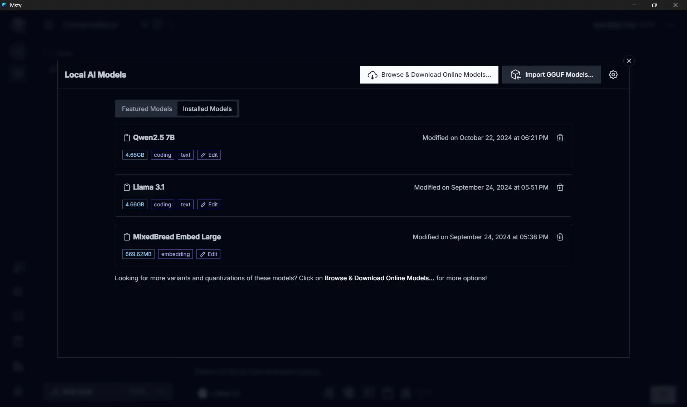
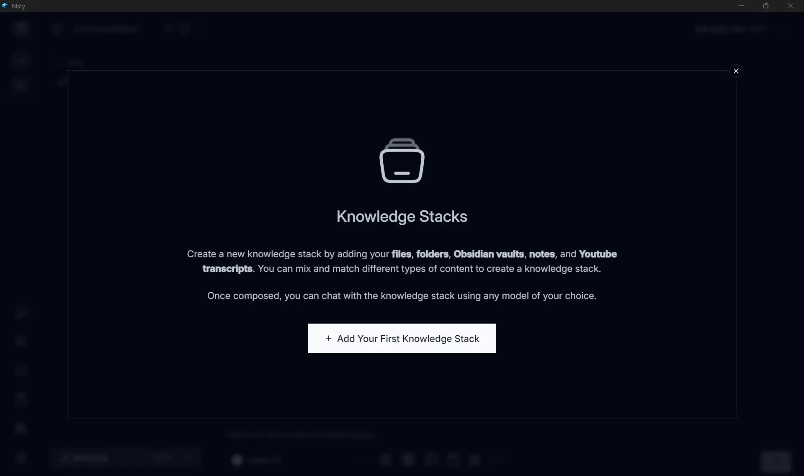
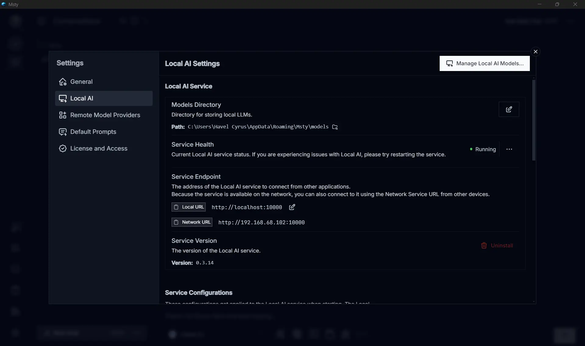
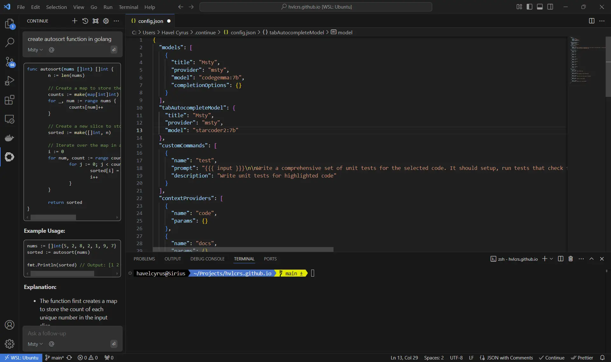

## ChatGPT, Copilot, Gemini... dan LocalLLM

Melihat perkembangan AI sekarang ini, sangat susah rasanya untuk menutup mata dengan pengunaan AI untuk keperluan pekerjaan ataupun pribadi. Terdapat banyak sekali pilihan seperti ChatGPT, Copilot, ataupun Gemini. Untuk kebanyakan orang, ChatGPT sudah sangat cukup untuk memenuhi kebutuhan sehari-hari.

Tapi di lain sisi, kadang kita perlu bantuan AI untuk hal-hal yang spesifik seperti brainstorming dengan konteks yang tepat atau coding dengan AI model tertentu. Shortcut untuk hal ini paling mudah tentu saja dengan copy-paste konten sebagai bagian dari prompt ke LLM backend. Sebagian AI chat juga sudah mensupport RAG input dengan dokumen seperti Copilot misalnya, atau ChatGPT yang akhirnya juga merilis fitur ini untuk publik. Masalahnya, di kasus-kasus tertentu data ini adalah data sensitif, yang tentunya tidak boleh sembarangan diupload ke AI provider tersebut. Disinilah LocalLLM berguna.

## Kegunaan LocalLLM

Apa itu LocalLLM? Sederhananya, ini seperti model bahasa raksasa yang jalan di komputer kita sendiri, bukan di cloud. Keuntungannya? Bisa dipakai offline dan lebih aman. Tapi dengan konsekuensinya tersendiri, performa bisa jadi lebih lambat dan kurang akurat kecuali kita punya komputer dengan spesifikasi yang mumpuni.

## Setup LocalLLM

Aplikasi favorit saya adalah [Msty](https://msty.app/). Aplikasi ini bisa menjalankan local model di CPU (dengan memory yang cukup) atau dengan GPU acceleration. Selain aplikasi ini, ada juga aplikasi populer lainnya seperti LMStudio atau llama.cpp, yang lebih fleksibel. Msty lebih cocok untuk keperluan saya karena aplikasi ini memiliki UI yang baik dan simple.

Setupnya cukup sederhana, model yang saya gunakan adalah `LLama 3.1 8B` dari Meta yang bisa didownload dari HuggingFace. Model ini biasanya digunakan untuk keperluan standar.
Untuk coding, saya lebih suka dengan performa `Codegemma`, sementara untuk RAG nya menggunakan `Mixed Breed Embed Large`. Ketiga model ini sudah cukup untuk memenuhi hampir semua keperluan coding ataupun general usage.

## Use cases

Selain untuk kerjaan, saya sering memakai laptop untuk menulis blog seperti ini atau sekadar ngoding santai. Penggunaan AI juga tidak jauh-jauh dari itu. Kalau brainstorming atau mengerjakan tugas-tugas umum sebenarnya akan lebih simple jika memaakai prompt UI aja.
Tapi ada satu fitur yang menurut saya cukup keren: knowledge stack. Jadi, dokumen yang kita berikan ke plugin RAG bakal ditokenisasi dan disimpan di database vektor. Nah, dari situ, kita bisa tanya-tanya ke agen tentang info dari manual/buku yang diberikan tanpa perlu repot baca semua atau cari kata kunci. Fitur ini sering saya gunakan untuk mencari kesimpulan dari manual atau post yang cukup panjang untuk menghemat waktu.

Untuk urusan bantu-bantu ngoding, saya memakai ekstensi VSCode bernama [Continue](https://marketplace.visualstudio.com/items?itemName=Continue.continue). Walaupun jarang ada yang pakai, saya rasa ini lumayan berguna buat analisis dan review kode proprietary tanpa harus melanggar NDA karena semuanya berjalan secara lokal.

## Integrasi Continue dengan Visual Studio Code

### Langkah 1: Instalasi model

Pertama-tama, kita harus sudah menginstall model yang diperlukan di Msty. Proses instalasi ini sangat mudah, cukup download model yang diperlukan dari `Local AI Models`. Saya menggunakan dua model untuk keperluan coding. `codegemma:7B` untuk code completion dan `starcoder2:7b` untuk tab completion. Setelah kita mengunduh kedua model ini, pastikan fitur local server di Msty sudah diaktifkan dan berjalan di background. Secara default, dia akan berjalan di port 10000.

### Langkah 2: Instalasi ekstensi VSCode

Selanjutnya, download ekstensi yang diperlukan dari VSCode [marketplace](https://marketplace.visualstudio.com/items?itemName=Continue.continue). Setelah selesai menginstall, saatnya melakukan konfigurasi remote target melalui `config.json`. Kita bisa menemukan detail nya disini:

Langsung saja akses file settings dari chat tab Continue di context menu.

### Langkah 3: Fine-tuning dan penyesuaian

Ingin melakukan ubahan dan tweak lebih lanjut? Kita bisa membaca semua konfigurasi ektensinya langsung dari halaman [dokumentasi](https://docs.continue.dev/customize/model-providers/more/msty) Continue.

## Kesimpulan

Baik Local LLM dan Cloud AI memiliki kegunaannya masing masing. Pilihan antara keduanya sangat tergantung dari keperluan individu. Jika konteks lokal, privasi data, dan kustomisasi menjadi prioritas utama, maka LocalLLM adalah opsi terbaik. Tapi jika kemudahan pengunaan dan kecepatan yang lebih diperlukan, aplikasi yang menggunakan cloud seperti ChatGPT akan lebih cocok. Menggunakan kedua solusi ini secara bersamaan juga merupakan opsi. Kita bisa beralih dari lokal ataupun cloud tergantung pada kebutuhan kita.
