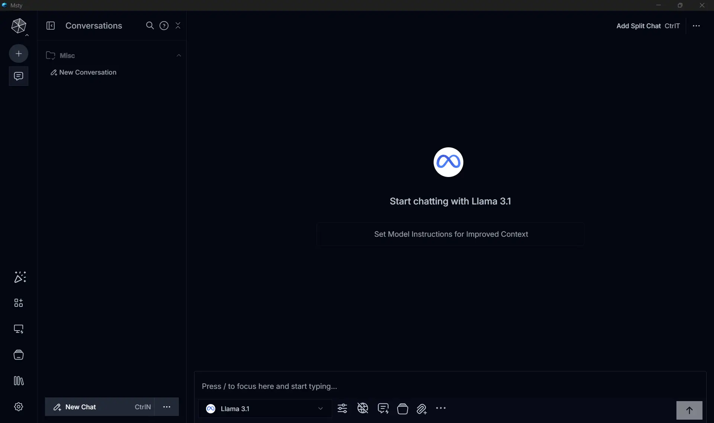
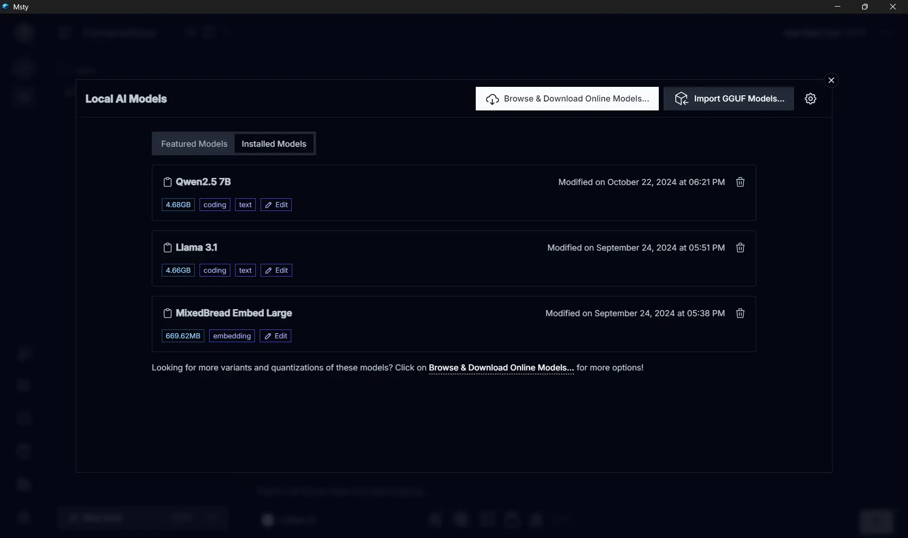
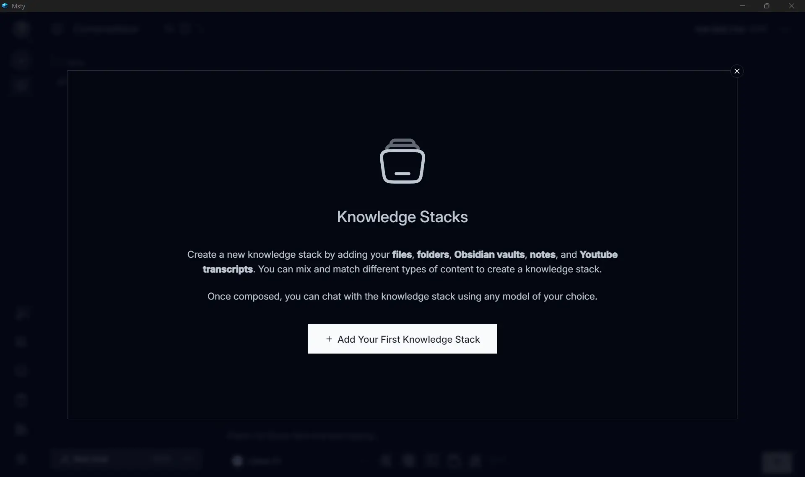
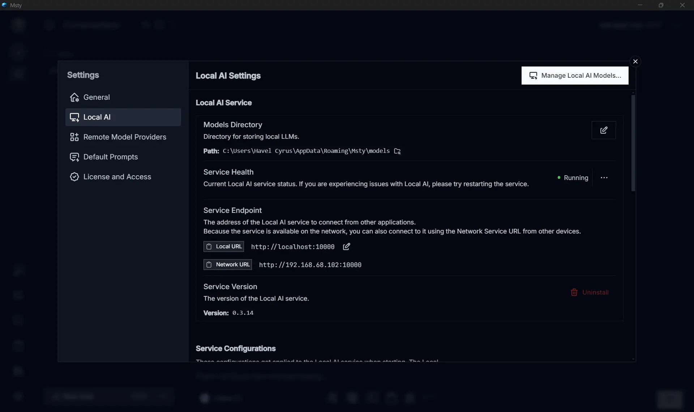
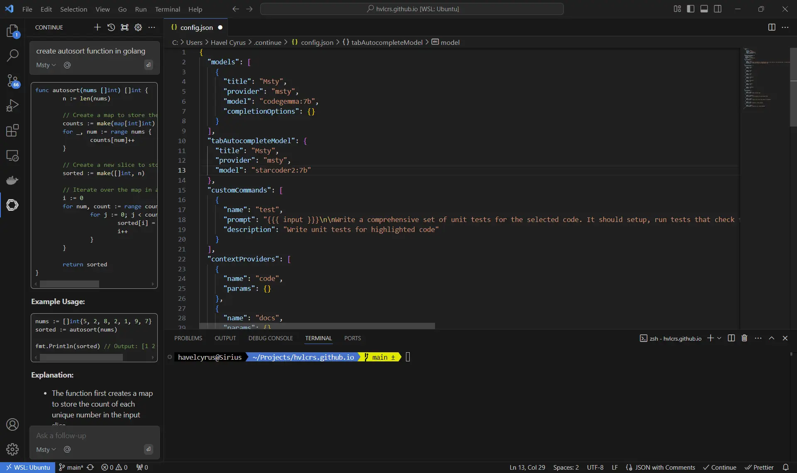

## ChatGPT, Copilot, Gemini... and LocalLLM

In the current AI landscape, cloud providers like ChatGPT, Claude or Gemini are the default for general tasks.

However, for engineers handling sensitive documents, internal system architectures, or proprietary codebases, the "cloud- irst" approach presents a significant data governance risk.

When you prompt a cloud LLM, your data often becomes part of the training loop. To mitigate this without losing the productivity gains of AI, I’ve shifted to a Local LLM architecture for my private workflows.

## LocalLLM setup

For local execution, I use [Msty](https://msty.app/). While tools like `llama.cpp` or `LMStudio` offer more granular control, Msty provides a robust UI and a built-in local server that simplifies integration with other tools.

My setup is quite simple, I installed one of the most popular model from HuggingFace, Meta's `LLama 3.1 8B` for general use.
I use `Codegemma` for code related stuffs, and `Mixed Breed Embed Large` for RAGs.
Those three models alrady covers almost all of my use case.

## Use cases

The most impactful part of a local setup is the Retrieval Augmented Generation (RAG) capability. By tokenizing local PDFs or technical books into a vector database, I can query my own "Knowledge Stack."

This transforms static documentation into an interactive agent. Instead of grepping through 500-page manuals for a specific circuit breaker pattern or API versioning rule, I can ask the local model for the exact context saving hours of manual search without ever uploading the data to a third party server.

For code assistance, I use a VSCode extension called [Continue](https://marketplace.visualstudio.com/items?itemName=Continue.continue). Even though it's rarely used, I find it quite helpful to analyze and review proprietary code without breaking any NDA since everything runs locally.

## Continue integration with Visual Studio Code

### Step 1: Install the model

First things first, let's get that model installed in Msty. It's super straightforward! Just download it from the `Local AI Models`. Personally, I love using two models for my coding needs: `codegemma:7B` for general code completion and `starcoder2:7b` for tab completion. After you've got those models, make sure your local server is up and running in the background—it usually runs on port 10000 by default.

### Step 2: Install the VSCode extension

Next up, let's get the extension from the VSCode [marketplace](https://marketplace.visualstudio.com/items?itemName=Continue.continue). Once you've finished installing it, it's time to configure the remote target through the `config.json` file. You can find all the nitty-gritty details here:

Just access the file settings from the Continue chat tab context menu.

### Step 3: Fine-tuning and tweaks

Want to make some tweaks and adjustments? You can read all about the settings and configurations directly from the Continue [docs](https://docs.continue.dev/customize/model-providers/more/msty).
