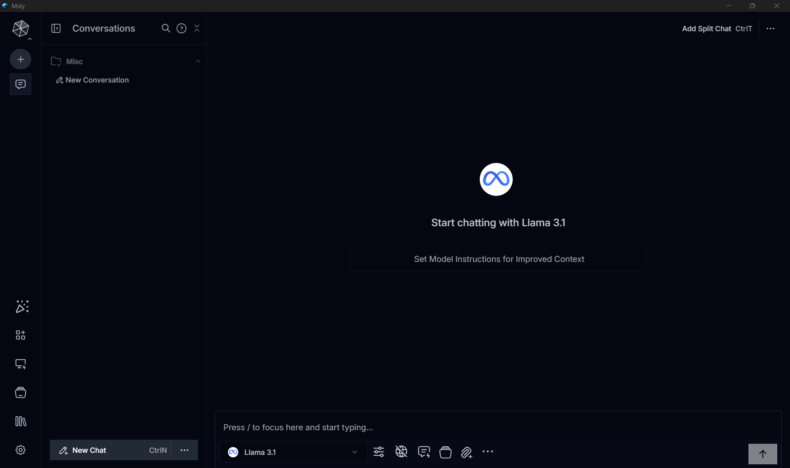
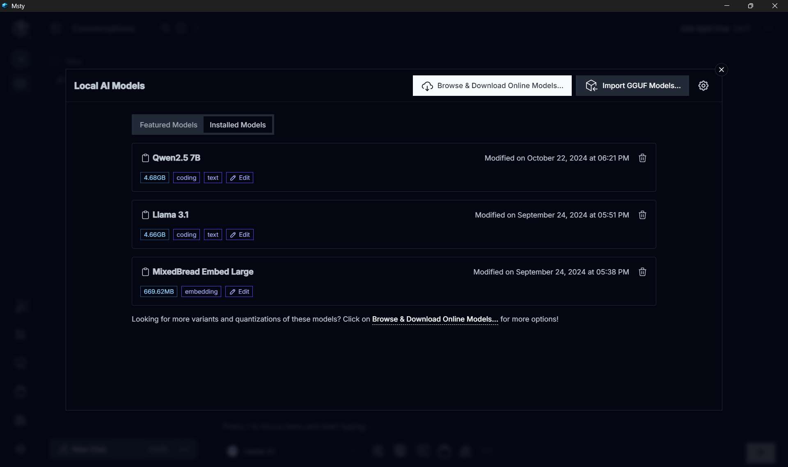
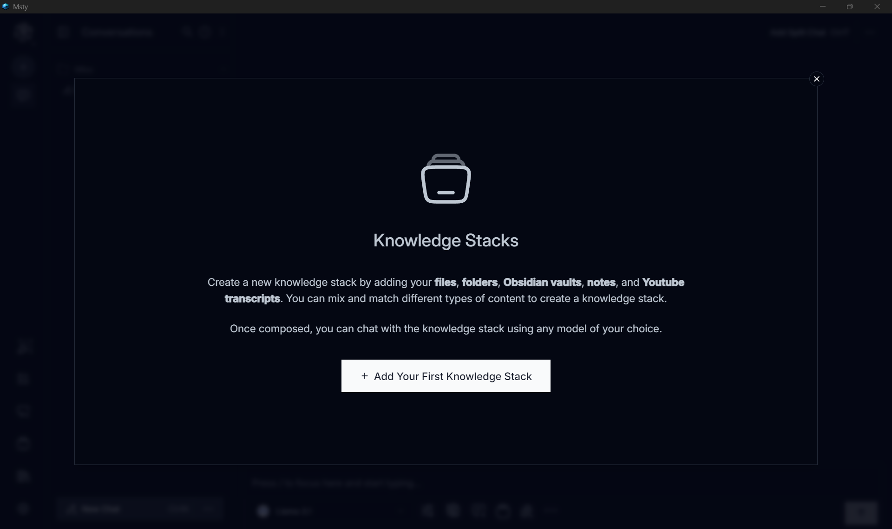
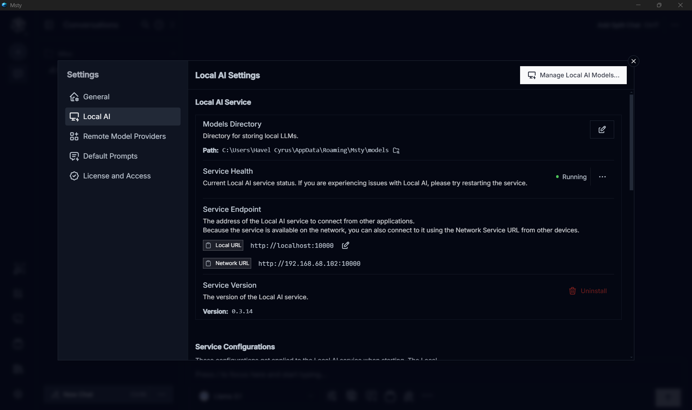
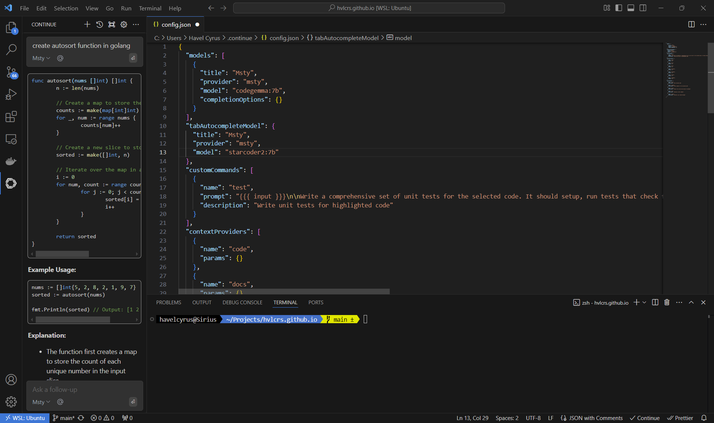

## ChatGPT, Copilot, Gemini... and LocalLLM

With all the AI buzzing left and right, it's hard not to jump on the bandwagon. ChatGPT, Copilot, Gemini... so many choices out there! For the general masses, ChatGPT is more than enough to cover the needs.

Now for the tricky part. Sometimes, we need AI help to handle big documents, brainstorm with the right context, or code with a specialized AI model. Sure, you can copy-paste information as a prompt or use RAG to feed data to the LLM backend. But these easy ways come at a price—your prompt becomes part of the AI model's training data, which can be a BIG problem if it contains important information. This is where local LLMs come to the rescue.

## Enter the LocalLLM

What is LocalLLM? It's basically a large language model running on your machine instead of the cloud.
It offers benefits like offline capability and more security, though it may be slower and less accurate unless you have a powerful machine.

## LocalLLM setup

My favorite app to run this is [Msty](https://msty.app/).
It supports running local models on a CPU (if you have enough memory) and offers GPU acceleration. There are other popular options like LMStudio or llama.cpp, which offer more flexibility, but I prefer a nice UI, and Msty provides just that.

My setup is quite simple, I installed one of the most popular model from HuggingFace, Meta's `LLama 3.1 8B` for general use.
I use `Qwen` for code related stuffs, and `Mixed Breed Embed Large` for RAGs.
Those three models alrady covers almost all of my use case.

## Use cases

Aside from work, I often use my laptop to write blogs like this or do a bit of coding. My AI use cases also revolve around that. Brainstorming or doing general tasks is straightforward through the prompt UI.

One feature I find super useful for more contextual results is the knowledge stack. It consumes the document we provide through the RAG plugin, tokenizes the content, and stores it in a vector database. This way, I can ask the agent for information from manuals/books without needing to read or search for keywords. Trust me, it saves hours!!

For code assistance, I use a VSCode extension called [Continue](https://marketplace.visualstudio.com/items?itemName=Continue.continue). Even though it's rarely used, I find it quite helpful to analyze and review proprietary code without breaking any NDA since everything runs locally.

## Continue integration with Visual Studio Code

### Step 1: Install the Model

First things first, let's get that model installed in Msty. It's super straightforward! Just download it from the `Local AI Models`. Personally, I love using two models for my coding needs: `codegemma:7B` for general code completion and `starcoder2:7b` for tab completion. After you've got those models, make sure your local server is up and running in the background—it usually runs on port 10000 by default.

### Step 2: Install the VSCode Extension

Next up, let's get the extension from the VSCode [marketplace](https://marketplace.visualstudio.com/items?itemName=Continue.continue). Once you've finished installing it, it's time to configure the remote target through the `config.json` file. You can find all the nitty-gritty details here:

Just access the file settings from the Continue chat tab context menu.

### Step 3: Fine-Tuning and Tweaks

Want to make some tweaks and adjustments? You can read all about the settings and configurations directly from the Continue [docs](https://docs.continue.dev/customize/model-providers/more/msty). Happy customizing!

## Conclusion

Both Local LLMs and cloud AI have their own strengths and weaknesses. The choice between the two depends on your specific needs and priorities. If local context, data privacy, and customization are important, go for local LLMs. However, for versatility, speed, and broad applicability, cloud options like ChatGPT are excellent choices.

Ultimately, the best solution often lies in a hybrid approach, leveraging the strengths of both local LLMs and global models to meet diverse AI requirements effectively.
