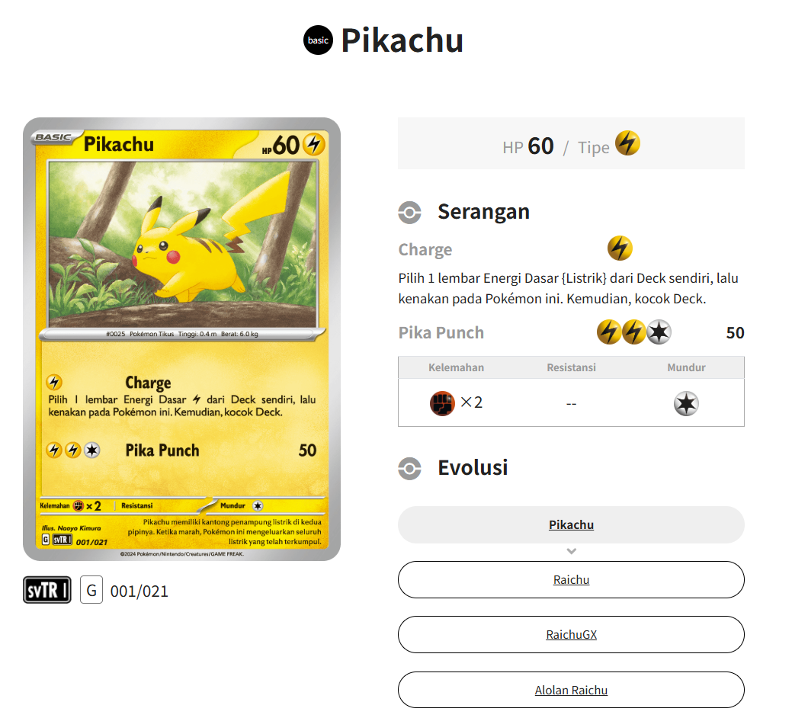
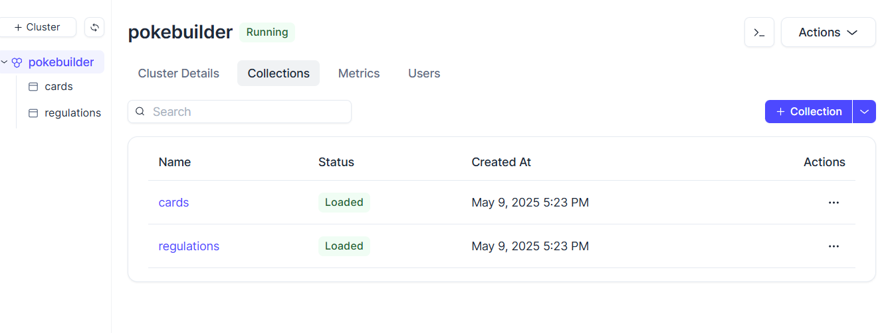
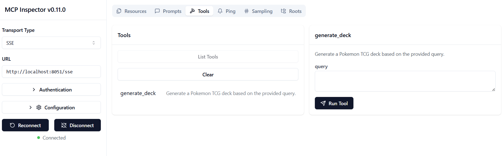
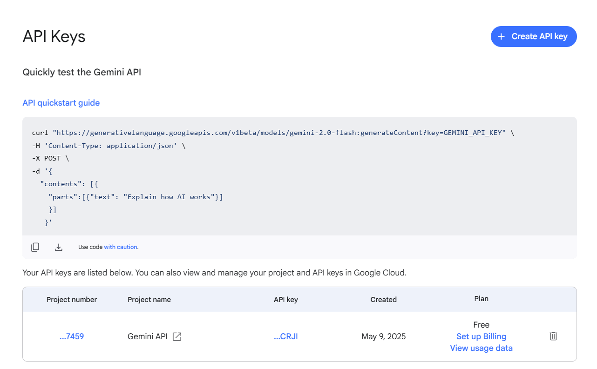
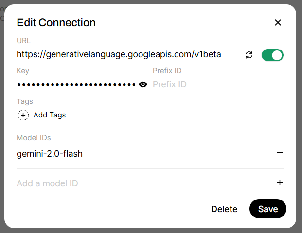
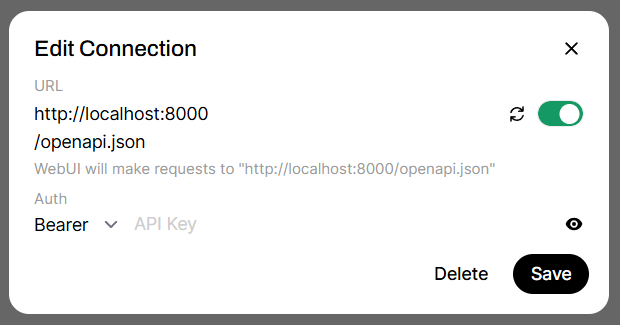
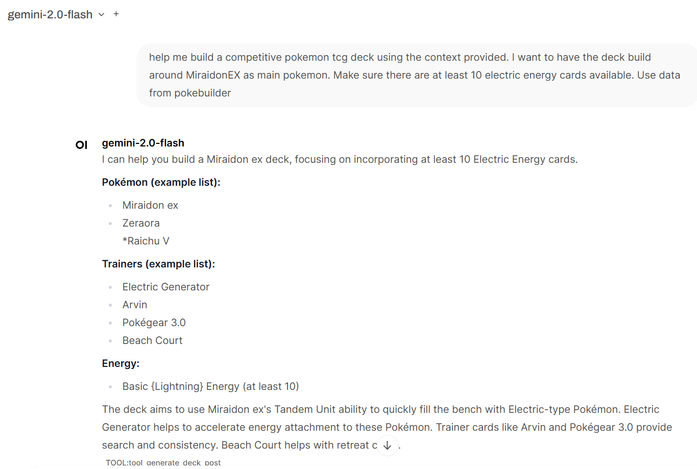

Pokémon has always been a huge part of my life! Every time a new game drops, you can bet it’s a day-one purchase for me. The Trading Card Game (TCG), however, has been a different story. Initially, I collected Pokémon cards just for fun—no competitive play, just pure joy. But my collection came to an abrupt halt when my parents banned me from collecting them (tragic, right?).
Fast forward to a year ago, when I took my daughter to a Pokémon Festival—and that’s when the magic reignited! My little daughter asked for some cool sets and BOOM, I found myself diving back into the world of Pokémon TCG, both collecting and playing. What amazed me was how little had changed in the game itself. Sure, the competitive meta evolves due to power creep, and cards cycle out every year, but the core mechanics remain familiar.

## Application architeture

Last weekend, I had some free time and thought, "How can I make deck building easier?" Abruptly, I turned to the internet. But all I found were meta deck explanations and prebuilt tactical deck guides, great for competitive players, but not much help if you want to build a deck around a non meta Pokémon.
Sure, I could ask the community for advice, but that takes time. That’s when I had a lightbulb moment, why not use AI to solve this problem?

I envisioned a simple system:

- A scraper to gather card data from websites
- A database to store the information
- Some retrieval mechanisms to fetch relevant data
- An MCP server to expose this data to AI agents

So, I started with something like this:


**TLDR; If you don't want to read the rest of the article and simply want to look at the code, it can be accessed [here](https://github.com/hvlcrs/pokebuilder). Else, let's go on!!**

## Scraping the cards

The first step was scraping card data. Since I play using the regional Indonesia cards, big websites like [Serebii](https://serebii.net) weren’t an option—some card names differ. That left me with the official Pokémon site, which thankfully provides all the necessary details. With that sorted, I could begin extracting the data!

For this task, I chose [crawl4ai](https://github.com/unclecode/crawl4ai). It automatically chunks website sections, making it easier for AI tools to process the data—huge time-saver! Once the data was scraped, the next step was storing it in a vector database.

## Embedding and storing the data

Since I wanted this tool to be accessible online, I initially leaned toward managed services. Carrying my laptop to casual TCG battles? Not cool.
My database of choice is Milvus. There are other capable vector databases like chroma, qdrant, or even supabase. However, Ziliz, the managed Milvus service, is the most generous with it's free offerings. That is the deciding factor.
I started with OpenAI for embedding, but reality hit fast, no free trial! That led me to explore alternatives like Gemini, Nomic, and others, but each had limitations for text embeddings. Given the large amount of scraped data, I decided to go local instead. Enter Ollama!
Both Ollama and the embedding model can be easily installed with following commands:

```bash
    curl -fsSL https://ollama.com/install.sh | sh
    ollama pull nomic-embed-text
```

With the necessary embedding system and the database already set up. The next step is to process the data.
To keep things simple, I started with just two collections:

- regulations (for game rules and restrictions)
- cards (for all Pokémon TCG card data)

Creating these collections programmatically was straightforward:

```python
    schema = milvus_client.create_schema(
        auto_id=True,
        enable_dynamic_field=True,
    )
    schema.add_field(field_name="id", datatype=DataType.INT64, is_primary=True)
    schema.add_field(field_name="vector", datatype=DataType.FLOAT_VECTOR,dim=768) #3072 for gemini, 1536 for openai, 768 for ollama

    index_params = milvus_client.prepare_index_params()
    index_params.add_index(
        field_name="id",
        index_type="AUTOINDEX"
    )

    index_params.add_index(
        field_name="vector", 
        index_type="AUTOINDEX",
        metric_type="COSINE"
    )

    # Create a collection in Milvus if it doesn't exist
    if not milvus_client.has_collection(collection_name):
        milvus_client.create_collection(
            collection_name=collection_name,
            consistency_level="Strong",
            schema=schema,
            index_params=index_params,
        )
```

After the code executed, the initiated collections can be seen from Ziliz's dashboard

Each collection has auto-indexing (because, let’s be honest, I’m lazy 😆), and I use the `COSINE` metric for data relativity. The key takeaway here is that the vector dimension must match the embedding system. If I ever switch to OpenAI, I’ll need to update the schema accordingly.
Embedding the data using Ollama is ridiculously simple, it’s just one line of code:

```python
    ollama.embed(model="nomic-embed-text", input=text).embeddings[0]
```

## Bringing the MCP server to life

With everything now standardized, at least in the Python world, spinning up an MCP server is super fast. Thanks to libraries like `FastMCP`, it takes just a few lines of code to get things up and running:

```python
    # Initialize FastMCP server
    mcp = FastMCP(
        "pokebuilder",
        description="MCP server for Pokemon TCG deck building",
        host=os.getenv("MCP_HOST", "0.0.0.0"),
        port=os.getenv("MCP_PORT", "8051")
    )
```

And just like that, the MCP server is live! 🎉
Now that the server is up and running, the next step is to build a RAG system to fetch relevant data from the database. This will be exposed as an MCP tool, allowing an AI agent to use it for deck building assistance.
For this initial version, the regulations are static, but in the future, I might add features to help build competitive tournament decks—that’s a project for another day!
When it comes to selecting relevant cards, the idea is simple:

- The user prompt is passed as a query to the database.
- The system finds relevant cards based on keywords.
- Since most competitive decks use around 15 different cards, I set the query limit to 30 cards, giving some extra flexibility.

Here’s how the query works:

```python
    # Get the context for cards selection
    card_result = milvus_client.search(
        collection_name="cards",
        data=[emb_ollama(query)],
        limit=30,
        search_params={"metric_type": "COSINE", "params": {}},
        output_fields=["text"],
    )
    card_distance = [
        (res["entity"]["text"], res["distance"]) for res in card_result[0]
    ]
    card_context = "\n".join(
        [line_with_distance[0] for line_with_distance in card_distance]
    )
```

Once the query results are retrieved, I combine the card text based on relevance (distance metric) into a single formatted string. This ensures the information is structured properly for AI processing.
Now, it’s time to generate the user prompt! This prompt structure ensures the AI understands the deck-building rules, available cards, and user preferences:

```python
    # Generate the user prompt
    user_prompt = f"""
    Use the following pieces of deck building and battle information enclosed in <regulations> tags to build a pokemon deck with a selection of cards enclosed in <> tags using parameters enclosed in <query> tags.
    <regulations>
    {regulation_context}
    </regulations>
    <cards>
    {card_context}
    </cards>
    <query>
    {query}
    </query>
    """
```

Now that everything is set up, it’s time for the testing, whether the MCP server is running correctly! Thankfully, FastMCP comes with a built-in MCP inspector tool, making debugging super easy.
To check if everything is working, simply run:

```bash
    mcp dev src/mcp_server.py
```

Once the inspector tool is running, you can access it at `http://localhost:6274/#tools`

Using this tool, we can test the MCP server tools and prompts. Just make sure that the transport type is set to SSE and that it points to the correct URL.

## Setting up the UI

Since I plan to deploy this application online, I need a web-based UI. That led me to [openwebui](https://github.com/open-webui/open-webui), a fantastic web-based interface that can run anywhere!
The good news? It’s super flexible!
The bad news? It doesn’t support SSE based MCP servers natively.
But don’t worry, this is easily fixable! All we need is a proxy in front of our MCP server. For this, I used an openwebui extension called [mcpo](https://github.com/open-webui/mcpo), which can be installed globally using `pipx`.
To run the mcpo server and target our MCP, simply use:

```bash
    mcpo --port 8000 --server-type "sse" -- http://localhost:8051/sse
```

While Ollama works great locally, I want to access this from my phone. That means the MCP server needs to process prompts using a cloud machine (or maybe I’ll host it in my local lab—still undecided!).
For now, I’m keeping things simple, so Gemini it is!

### Setting up Gemini with OpenWebUI

First, we need to get the Gemini API key to integrate it with OpenWebUI.

Then, configure the UI to list Gemini as its backend:

- Access the settings and go to Connections
- Add Gemini backend URL `https://generativelanguage.googleapis.com/v1beta`
- Add the token
- Manually add the model ID, for example `gemini-2.0-flash`


### Connecting OpenWebUI to the MCP

Now, let’s connect the UI to our MCP server:

- Access the settings and go to Tools
- Input the mcpo running proxy URL as the target, by default it is `http://localhost:8000/openapi.json`


## Time to build our deck

With everything set up, we can finally start building our Pokémon TCG deck!

For now, the results feel a bit sketchy, but tweaking the parameters should help refine things. Interestingly, running the prompt directly as a RAG application instead of through MCP yields better results with the current setup, something that still puzzles me.
That’s my homework for now! The next step? Deploying this in the cloud—but that’s a project for another weekend. 😆
